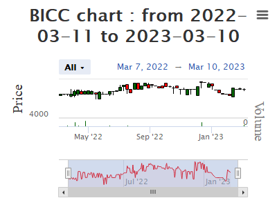

<!-- README.md is generated from README.Rmd. Please edit that file -->

# BRVM

<!-- badges: start -->

[](https://cran.r-project.org/package=BRVM)

 [](https://lifecycle.r-lib.org/articles/stages.html##experimental)
[](https://makeapullrequest.com)
<!-- badges: end -->

# BRVM

BRVM is an R package that provides real-time data from the BRVM
(“Regional Securities Exchange SA” call Bourse Régionale des Valeurs
Mobilières in french). As a goal, we want to facilitate access to data
for all users of the R programming language. This package includes a
variety of data accessible just by function call.

BRVM est un package R qui permet d’obtenir des données à temps réel de
la BRVM (Bourse Régionale des Valeurs Mobilières). Comme objectif, nous
voulons faciliter l’accès aux données à tous les utilisateurs du langage
de programmation R. Ce package comporte une diversité de données
accessibles juste par appel de fonction.

## Installation

You can install the development version of BRVM from
[GitHub](https://github.com/) with:

``` r
# install.packages("devtools")
devtools::install_github("Koffi-Fredysessie/BRVM")
```

## Example

This is a basic example which shows you how to solve a common problem:

``` r
library(BRVM)
```

Lets take a look at a simple function that receives no argument and
returns informations about BRVM market activities

``` r
BRVM_market_activity()
#> # A tibble: 6 × 3
#>   `Market Activities`     ``                      ``     
#>   <chr>                   <chr>                   <chr>  
#> 1 Value                   398 075 969 FCFA        ""     
#> 2 Equities Capitalization 7 732 371 300 810 FCFA  ""     
#> 3 Bonds Capitalization    10 153 091 190 084 FCFA ""     
#> 4 BRVM-C                  207.85                  "0.42%"
#> 5 BRVM-30                 104.07                  "0.60%"
#> 6 BRVM-PRES               107,15                  "0,08%"
```

The following function plot candlestick charts of ticker BICC

``` r
 library(highcharter)
 library(lubridate)
 library(rlang)
 library(httr2)
 library(dplyr)
 library(stringr)
 library(xts)
BRVM_plot("BICC")
#> [1] "BICC"
```



BRVM_ticker_desc function receives no argument and returns informations
about BRVM exchange companies.

``` r
BRVM_ticker_desc()
#> # A tibble: 47 × 4
#>    Ticker `Company name`                 Sector       Country     
#>    <chr>  <chr>                          <fct>        <fct>       
#>  1 ABJC   SERVAIR ABIDJAN  COTE D'IVOIRE DISTRIBUTION IVORY COAST 
#>  2 BICC   BICI COTE D'IVOIRE             FINANCE      IVORY COAST 
#>  3 BNBC   BERNABE COTE D'IVOIRE          DISTRIBUTION IVORY COAST 
#>  4 BOAB   BANK OF AFRICA BENIN           FINANCE      BENIN       
#>  5 BOABF  BANK OF AFRICA BURKINA FASO    FINANCE      BURKINA FASO
#>  6 BOAC   BANK OF AFRICA COTE D'IVOIRE   FINANCE      IVORY COAST 
#>  7 BOAM   BANK OF AFRICA MALI            FINANCE      MALI        
#>  8 BOAN   BANK OF AFRICA NIGER           FINANCE      NIGER       
#>  9 BOAS   BANK OF AFRICA SENEGAL         FINANCE      SENEGAL     
#> 10 CABC   SICABLE COTE D'IVOIRE          INDUSTRY     IVORY COAST 
#> # … with 37 more rows
```

You’ll still need to render `README.Rmd` regularly, to keep `README.md`
up-to-date. `devtools::build_readme()` is handy for this. You could also
use GitHub Actions to re-render `README.Rmd` every time you push. An
example workflow can be found here:
<https://github.com/r-lib/actions/tree/v1/examples>.
