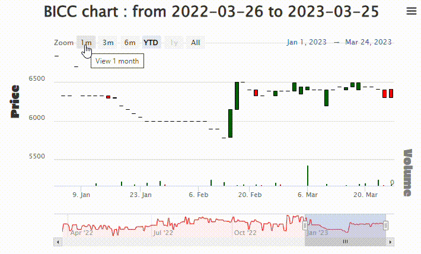
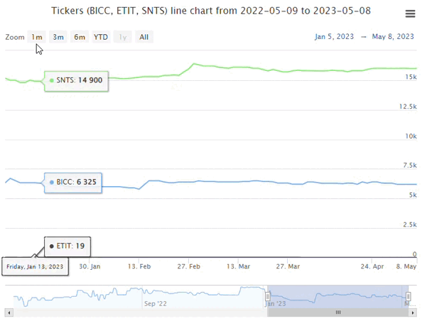

<!-- README.md is generated from README.Rmd. Please edit that file -->


<!--  -->

<!-- badges: start -->
[](https://cran.r-project.org/package=BRVM)


[](https://lifecycle.r-lib.org/articles/stages.html##experimental)
[](https://makeapullrequest.com)
<!-- badges: end -->

## BRVM
### Description {.tabset}
#### English
This R package provides a user-friendly interface for accessing data from the BRVM, which is a regional stock exchange serving multiple West African countries. With this package, users can easily retrieve historical stock price data, trading volumes, and other financial indicators for a variety of stocks traded on the BRVM.

The package is designed to simplify the process of gathering and analyzing financial data, making it easier for researchers, investors, and other users to extract insights and make informed decisions based on the information available. Overall, `BRVM` library is a valuable tool for anyone looking to gain a better understanding of the BRVM and the financial markets in West Africa.

#### Français
Ce package R fournit une interface conviviale pour accéder aux données de la BRVM, qui est une bourse régionale desservant plusieurs pays d'Afrique de l'Ouest. Avec ce package, les utilisateurs peuvent facilement récupérer des données historiques sur les prix des actions, les volumes de transactions et d'autres indicateurs financiers pour une variété d'actions négociées sur la BRVM.

Le package est conçu pour simplifier le processus de collecte et d'analyse de données financières, ce qui facilite la tâche des chercheurs, des investisseurs et d'autres utilisateurs pour extraire des informations et prendre des décisions éclairées en se basant sur les informations disponibles. Dans l'ensemble, notre package R est un outil précieux pour quiconque cherche à mieux comprendre la BRVM et les marchés financiers en Afrique de l'Ouest.

## Installation guidelines


You can install using CRAN version


```r
install.packages("BRVM")
```


You can install the development version of BRVM from [github](https://github.com/Koffi-Fredysessie/BRVM) with:


```r
# github dev version
## We can use devtools
# install.packages("devtools")
devtools::install_github("Koffi-Fredysessie/BRVM")

# Or use remotes
# install.packages("remotes")
remotes::install_github("Koffi-Fredysessie/BRVM")
```

## Html version of the Readme 
Since the size of the readme is huge due to the charts, you can visit the html version of the readme on [RPubs](https://rpubs.com/Fredysessie/Readme_BRVM_Stock)


```r
library(BRVM)
```


## The **BRVM_ticker_desc()** function
 
It receives no argument and returns BRVM tickers information such as its full name, sector and country.


```r
# Display tickers of BRVM
tickers <- BRVM_ticker_desc()
tickers
```
<table class="table table-striped" style="margin-left: auto; margin-right: auto;">
 <thead>
  <tr>
   <th style="text-align:left;"> Ticker </th>
   <th style="text-align:left;"> Company name </th>
   <th style="text-align:left;"> Sector </th>
   <th style="text-align:left;"> Country </th>
  </tr>
 </thead>
<tbody>
  <tr>
   <td style="text-align:left;"> ABJC </td>
   <td style="text-align:left;"> SERVAIR ABIDJAN  COTE D'IVOIRE </td>
   <td style="text-align:left;"> DISTRIBUTION </td>
   <td style="text-align:left;"> IVORY COAST </td>
  </tr>
  <tr>
   <td style="text-align:left;"> BICC </td>
   <td style="text-align:left;"> BICI COTE D'IVOIRE </td>
   <td style="text-align:left;"> FINANCE </td>
   <td style="text-align:left;"> IVORY COAST </td>
  </tr>
  <tr>
   <td style="text-align:left;"> BNBC </td>
   <td style="text-align:left;"> BERNABE COTE D'IVOIRE </td>
   <td style="text-align:left;"> DISTRIBUTION </td>
   <td style="text-align:left;"> IVORY COAST </td>
  </tr>
  <tr>
   <td style="text-align:left;"> BOAB </td>
   <td style="text-align:left;"> BANK OF AFRICA BENIN </td>
   <td style="text-align:left;"> FINANCE </td>
   <td style="text-align:left;"> BENIN </td>
  </tr>
  <tr>
   <td style="text-align:left;"> BOABF </td>
   <td style="text-align:left;"> BANK OF AFRICA BURKINA FASO </td>
   <td style="text-align:left;"> FINANCE </td>
   <td style="text-align:left;"> BURKINA FASO </td>
  </tr>
  <tr>
   <td style="text-align:left;"> BOAC </td>
   <td style="text-align:left;"> BANK OF AFRICA COTE D'IVOIRE </td>
   <td style="text-align:left;"> FINANCE </td>
   <td style="text-align:left;"> IVORY COAST </td>
  </tr>
  <tr>
   <td style="text-align:left;"> BOAM </td>
   <td style="text-align:left;"> BANK OF AFRICA MALI </td>
   <td style="text-align:left;"> FINANCE </td>
   <td style="text-align:left;"> MALI </td>
  </tr>
  <tr>
   <td style="text-align:left;"> BOAN </td>
   <td style="text-align:left;"> BANK OF AFRICA NIGER </td>
   <td style="text-align:left;"> FINANCE </td>
   <td style="text-align:left;"> NIGER </td>
  </tr>
  <tr>
   <td style="text-align:left;"> BOAS </td>
   <td style="text-align:left;"> BANK OF AFRICA SENEGAL </td>
   <td style="text-align:left;"> FINANCE </td>
   <td style="text-align:left;"> SENEGAL </td>
  </tr>
  <tr>
   <td style="text-align:left;"> CABC </td>
   <td style="text-align:left;"> SICABLE COTE D'IVOIRE </td>
   <td style="text-align:left;"> INDUSTRY </td>
   <td style="text-align:left;"> IVORY COAST </td>
  </tr>
  <tr>
   <td style="text-align:left;"> CBIBF </td>
   <td style="text-align:left;"> CORIS BANK INTERNATIONAL BURKINA FASO </td>
   <td style="text-align:left;"> FINANCE </td>
   <td style="text-align:left;"> BURKINA FASO </td>
  </tr>
  <tr>
   <td style="text-align:left;"> CFAC </td>
   <td style="text-align:left;"> CFAO MOTORS COTE D'IVOIRE </td>
   <td style="text-align:left;"> DISTRIBUTION </td>
   <td style="text-align:left;"> IVORY COAST </td>
  </tr>
  <tr>
   <td style="text-align:left;"> CIEC </td>
   <td style="text-align:left;"> CIE COTE D'IVOIRE </td>
   <td style="text-align:left;"> PUBLIC SERVICE </td>
   <td style="text-align:left;"> IVORY COAST </td>
  </tr>
  <tr>
   <td style="text-align:left;"> ECOC </td>
   <td style="text-align:left;"> ECOBANK COTE D'IVOIRE </td>
   <td style="text-align:left;"> FINANCE </td>
   <td style="text-align:left;"> IVORY COAST </td>
  </tr>
  <tr>
   <td style="text-align:left;"> ETIT </td>
   <td style="text-align:left;"> Ecobank Transnational Incorporated TOGO </td>
   <td style="text-align:left;"> FINANCE </td>
   <td style="text-align:left;"> TOGO </td>
  </tr>
  <tr>
   <td style="text-align:left;"> FTSC </td>
   <td style="text-align:left;"> FILTISAC COTE D'IVOIRE </td>
   <td style="text-align:left;"> INDUSTRY </td>
   <td style="text-align:left;"> IVORY COAST </td>
  </tr>
  <tr>
   <td style="text-align:left;"> NEIC </td>
   <td style="text-align:left;"> NEI-CEDA COTE D'IVOIRE </td>
   <td style="text-align:left;"> INDUSTRY </td>
   <td style="text-align:left;"> IVORY COAST </td>
  </tr>
  <tr>
   <td style="text-align:left;"> NSBC </td>
   <td style="text-align:left;"> NSIA BANQUE COTE D'IVOIRE </td>
   <td style="text-align:left;"> FINANCE </td>
   <td style="text-align:left;"> IVORY COAST </td>
  </tr>
  <tr>
   <td style="text-align:left;"> NTLC </td>
   <td style="text-align:left;"> NESTLE COTE D'IVOIRE </td>
   <td style="text-align:left;"> INDUSTRY </td>
   <td style="text-align:left;"> IVORY COAST </td>
  </tr>
  <tr>
   <td style="text-align:left;"> ONTBF </td>
   <td style="text-align:left;"> ONATEL BURKINA FASO </td>
   <td style="text-align:left;"> PUBLIC SERVICE </td>
   <td style="text-align:left;"> BURKINA FASO </td>
  </tr>
  <tr>
   <td style="text-align:left;"> ORAC </td>
   <td style="text-align:left;"> ORANGE COTE D'IVOIRE </td>
   <td style="text-align:left;"> PUBLIC SERVICE </td>
   <td style="text-align:left;"> IVORY COAST </td>
  </tr>
  <tr>
   <td style="text-align:left;"> ORGT </td>
   <td style="text-align:left;"> ORAGROUP TOGO </td>
   <td style="text-align:left;"> FINANCE </td>
   <td style="text-align:left;"> TOGO </td>
  </tr>
  <tr>
   <td style="text-align:left;"> PALC </td>
   <td style="text-align:left;"> PALM COTE D'IVOIRE </td>
   <td style="text-align:left;"> AGRICULTURE </td>
   <td style="text-align:left;"> IVORY COAST </td>
  </tr>
  <tr>
   <td style="text-align:left;"> PRSC </td>
   <td style="text-align:left;"> TRACTAFRIC MOTORS COTE D'IVOIRE </td>
   <td style="text-align:left;"> DISTRIBUTION </td>
   <td style="text-align:left;"> IVORY COAST </td>
  </tr>
  <tr>
   <td style="text-align:left;"> SAFC </td>
   <td style="text-align:left;"> SAFCA COTE D'IVOIRE </td>
   <td style="text-align:left;"> FINANCE </td>
   <td style="text-align:left;"> IVORY COAST </td>
  </tr>
  <tr>
   <td style="text-align:left;"> SCRC </td>
   <td style="text-align:left;"> SUCRIVOIRE COTE D'IVOIRE </td>
   <td style="text-align:left;"> AGRICULTURE </td>
   <td style="text-align:left;"> IVORY COAST </td>
  </tr>
  <tr>
   <td style="text-align:left;"> SDCC </td>
   <td style="text-align:left;"> SODE COTE D'IVOIRE </td>
   <td style="text-align:left;"> PUBLIC SERVICE </td>
   <td style="text-align:left;"> IVORY COAST </td>
  </tr>
  <tr>
   <td style="text-align:left;"> SDSC </td>
   <td style="text-align:left;"> BOLLORE TRANSPORT &amp; LOGISTICS COTE D'IVOIRE </td>
   <td style="text-align:left;"> TRANSPORT </td>
   <td style="text-align:left;"> IVORY COAST </td>
  </tr>
  <tr>
   <td style="text-align:left;"> SEMC </td>
   <td style="text-align:left;"> CROWN SIEM COTE D'IVOIRE </td>
   <td style="text-align:left;"> INDUSTRY </td>
   <td style="text-align:left;"> IVORY COAST </td>
  </tr>
  <tr>
   <td style="text-align:left;"> SGBC </td>
   <td style="text-align:left;"> SOCIETE GENERALE COTE D'IVOIRE </td>
   <td style="text-align:left;"> FINANCE </td>
   <td style="text-align:left;"> IVORY COAST </td>
  </tr>
  <tr>
   <td style="text-align:left;"> SHEC </td>
   <td style="text-align:left;"> VIVO ENERGY COTE D'IVOIRE </td>
   <td style="text-align:left;"> DISTRIBUTION </td>
   <td style="text-align:left;"> IVORY COAST </td>
  </tr>
  <tr>
   <td style="text-align:left;"> SIBC </td>
   <td style="text-align:left;"> SOCIETE IVOIRIENNE DE BANQUE COTE D'IVOIRE </td>
   <td style="text-align:left;"> FINANCE </td>
   <td style="text-align:left;"> IVORY COAST </td>
  </tr>
  <tr>
   <td style="text-align:left;"> SICC </td>
   <td style="text-align:left;"> SICOR COTE D'IVOIRE </td>
   <td style="text-align:left;"> AGRICULTURE </td>
   <td style="text-align:left;"> IVORY COAST </td>
  </tr>
  <tr>
   <td style="text-align:left;"> SIVC </td>
   <td style="text-align:left;"> AIR LIQUIDE COTE D'IVOIRE </td>
   <td style="text-align:left;"> INDUSTRY </td>
   <td style="text-align:left;"> IVORY COAST </td>
  </tr>
  <tr>
   <td style="text-align:left;"> SLBC </td>
   <td style="text-align:left;"> SOLIBRA COTE D'IVOIRE </td>
   <td style="text-align:left;"> INDUSTRY </td>
   <td style="text-align:left;"> IVORY COAST </td>
  </tr>
  <tr>
   <td style="text-align:left;"> SMBC </td>
   <td style="text-align:left;"> SMB COTE D'IVOIRE </td>
   <td style="text-align:left;"> INDUSTRY </td>
   <td style="text-align:left;"> IVORY COAST </td>
  </tr>
  <tr>
   <td style="text-align:left;"> SNTS </td>
   <td style="text-align:left;"> SONATEL SENEGAL </td>
   <td style="text-align:left;"> PUBLIC SERVICE </td>
   <td style="text-align:left;"> SENEGAL </td>
  </tr>
  <tr>
   <td style="text-align:left;"> SOGC </td>
   <td style="text-align:left;"> SOGB COTE D'IVOIRE </td>
   <td style="text-align:left;"> AGRICULTURE </td>
   <td style="text-align:left;"> IVORY COAST </td>
  </tr>
  <tr>
   <td style="text-align:left;"> SPHC </td>
   <td style="text-align:left;"> SAPH COTE D'IVOIRE </td>
   <td style="text-align:left;"> AGRICULTURE </td>
   <td style="text-align:left;"> IVORY COAST </td>
  </tr>
  <tr>
   <td style="text-align:left;"> STAC </td>
   <td style="text-align:left;"> SETAO COTE D'IVOIRE </td>
   <td style="text-align:left;"> OTHER </td>
   <td style="text-align:left;"> IVORY COAST </td>
  </tr>
  <tr>
   <td style="text-align:left;"> STBC </td>
   <td style="text-align:left;"> SITAB COTE D'IVOIRE </td>
   <td style="text-align:left;"> INDUSTRY </td>
   <td style="text-align:left;"> IVORY COAST </td>
  </tr>
  <tr>
   <td style="text-align:left;"> SVOC </td>
   <td style="text-align:left;"> MOVIS COTE D'IVOIRE </td>
   <td style="text-align:left;"> TRANSPORT </td>
   <td style="text-align:left;"> IVORY COAST </td>
  </tr>
  <tr>
   <td style="text-align:left;"> TTLC </td>
   <td style="text-align:left;"> TOTAL COTE D'IVOIRE </td>
   <td style="text-align:left;"> DISTRIBUTION </td>
   <td style="text-align:left;"> IVORY COAST </td>
  </tr>
  <tr>
   <td style="text-align:left;"> TTLS </td>
   <td style="text-align:left;"> TOTAL SENEGAL </td>
   <td style="text-align:left;"> DISTRIBUTION </td>
   <td style="text-align:left;"> SENEGAL </td>
  </tr>
  <tr>
   <td style="text-align:left;"> TTRC </td>
   <td style="text-align:left;"> TRITURAF Ste en Liquid </td>
   <td style="text-align:left;"> INDUSTRY </td>
   <td style="text-align:left;"> IVORY COAST </td>
  </tr>
  <tr>
   <td style="text-align:left;"> UNLC </td>
   <td style="text-align:left;"> UNILEVER COTE D'IVOIRE </td>
   <td style="text-align:left;"> INDUSTRY </td>
   <td style="text-align:left;"> IVORY COAST </td>
  </tr>
  <tr>
   <td style="text-align:left;"> UNXC </td>
   <td style="text-align:left;"> UNIWAX COTE D'IVOIRE </td>
   <td style="text-align:left;"> INDUSTRY </td>
   <td style="text-align:left;"> IVORY COAST </td>
  </tr>
</tbody>
</table>


## The **BRVM_index()** function :
It receives no argument and returns a table of updated data (with as table header: indexes, previous closing, closing, change (%), Year to Date Change) on all the indices available on the BRVM exchange.


```r
the_index <- BRVM_index() 
the_index
```
<table class="table table-striped" style="margin-left: auto; margin-right: auto;">
 <thead>
  <tr>
   <th style="text-align:left;"> Indexes </th>
   <th style="text-align:right;"> Previous closing </th>
   <th style="text-align:right;"> Closing </th>
   <th style="text-align:right;"> Change (%) </th>
   <th style="text-align:right;"> Year to Date Change </th>
  </tr>
 </thead>
<tbody>
  <tr>
   <td style="text-align:left;"> BRVM-30 </td>
   <td style="text-align:right;"> 104.31 </td>
   <td style="text-align:right;"> 104.49 </td>
   <td style="text-align:right;"> 0.17 </td>
   <td style="text-align:right;"> -0.36 </td>
  </tr>
  <tr>
   <td style="text-align:left;"> BRVM - AGRICULTURE </td>
   <td style="text-align:right;"> 158.18 </td>
   <td style="text-align:right;"> 157.35 </td>
   <td style="text-align:right;"> -0.52 </td>
   <td style="text-align:right;"> 2.09 </td>
  </tr>
  <tr>
   <td style="text-align:left;"> BRVM - OTHER SECTOR </td>
   <td style="text-align:right;"> 1054.97 </td>
   <td style="text-align:right;"> 1054.97 </td>
   <td style="text-align:right;"> 0.00 </td>
   <td style="text-align:right;"> 0.00 </td>
  </tr>
  <tr>
   <td style="text-align:left;"> BRVM - COMPOSITE </td>
   <td style="text-align:right;"> 207.86 </td>
   <td style="text-align:right;"> 208.27 </td>
   <td style="text-align:right;"> 0.20 </td>
   <td style="text-align:right;"> -0.36 </td>
  </tr>
  <tr>
   <td style="text-align:left;"> BRVM - DISTRIBUTION </td>
   <td style="text-align:right;"> 305.91 </td>
   <td style="text-align:right;"> 312.62 </td>
   <td style="text-align:right;"> 2.19 </td>
   <td style="text-align:right;"> 1.12 </td>
  </tr>
  <tr>
   <td style="text-align:left;"> BRVM - FINANCE </td>
   <td style="text-align:right;"> 83.92 </td>
   <td style="text-align:right;"> 84.80 </td>
   <td style="text-align:right;"> 1.05 </td>
   <td style="text-align:right;"> 0.45 </td>
  </tr>
  <tr>
   <td style="text-align:left;"> BRVM - INDUSTRY </td>
   <td style="text-align:right;"> 101.32 </td>
   <td style="text-align:right;"> 100.86 </td>
   <td style="text-align:right;"> -0.45 </td>
   <td style="text-align:right;"> -0.65 </td>
  </tr>
  <tr>
   <td style="text-align:left;"> BRVM - PRESTIGE </td>
   <td style="text-align:right;"> 97.41 </td>
   <td style="text-align:right;"> 98.06 </td>
   <td style="text-align:right;"> 0.67 </td>
   <td style="text-align:right;"> 1.05 </td>
  </tr>
  <tr>
   <td style="text-align:left;"> BRVM - PRINCIPAL </td>
   <td style="text-align:right;"> 101.59 </td>
   <td style="text-align:right;"> 101.98 </td>
   <td style="text-align:right;"> 0.38 </td>
   <td style="text-align:right;"> -1.06 </td>
  </tr>
  <tr>
   <td style="text-align:left;"> BRVM - PUBLIC SERVICES </td>
   <td style="text-align:right;"> 513.71 </td>
   <td style="text-align:right;"> 510.89 </td>
   <td style="text-align:right;"> -0.55 </td>
   <td style="text-align:right;"> -1.18 </td>
  </tr>
  <tr>
   <td style="text-align:left;"> BRVM - TRANSPORT </td>
   <td style="text-align:right;"> 359.60 </td>
   <td style="text-align:right;"> 364.38 </td>
   <td style="text-align:right;"> 1.33 </td>
   <td style="text-align:right;"> -3.48 </td>
  </tr>
</tbody>
</table>


## The **BRVM_get(".symbol", ".from", ".to")** function
 
This function will get the data of the companies listed on the BVRM stock exchange in Rich Bourse website. The function takes a single parameter, `.symbol` (which represents the "Ticker").
The function will automatically format tickers you enter in uppercase using toupper() and then ensure that the passed ticker is in a Google spreadsheet of allowed tickers.

* .symbol : A vector of symbols, like: c("BICC","XOM","SlbC") ;
* .from : A quoted start date, ie. "2020-01-01" or "2020/01/01". The date must be in ymd format "YYYY-MM-DD" or "YYYY/MM/DD" ;
* .to : A quoted end date, ie. "2022-01-31" or "2022/01/31". The date must be in ymd format "YYYY-MM-DD" or "YYYY/MM/DD".


```r

#' Displaying data of SONATEL Senegal stock
BRVM_get(.symbol = "snts")
#> # A tibble: 246 × 6
#>    Date        Open  High   Low Close Volume
#>    <date>     <dbl> <dbl> <dbl> <dbl>  <dbl>
#>  1 2023-02-14 15275 15300 15275 15300  10529
#>  2 2023-02-15 15400 15400 15305 15305   7023
#>  3 2023-02-16 15350 15350 15300 15300  22423
#>  4 2023-02-17 15400 15400 15300 15300  18325
#>  5 2023-02-20 15305 15395 15305 15395   4011
#>  6 2023-02-21 15395 15400 15395 15400   6237
#>  7 2023-02-22 15400 15440 15400 15440   4015
#>  8 2023-02-23 15440 15440 15400 15400  71763
#>  9 2023-02-24 15500 15690 15500 15690  22593
#> 10 2023-02-27 15700 15945 15700 15945  47984
#> # ℹ 236 more rows

symbols <- c("BiCc","XOM","SlbC")   # We use here three tickers
data_tbl <- BRVM_get(.symbol = symbols, .from = "2020-01-01", .to = Sys.Date() - 1)

# Display the first twenty observations of the table
head(data_tbl, 20)
#> # A tibble: 20 × 7
#>    Date        Open  High   Low Close Volume Ticker
#>    <date>     <dbl> <dbl> <dbl> <dbl>  <dbl> <chr> 
#>  1 2020-01-10  6500  6500  6500  6500     24 BICC  
#>  2 2020-01-13  6370  6500  6370  6500     29 BICC  
#>  3 2020-01-14  6495  6495  6495  6495     10 BICC  
#>  4 2020-01-29  6010  6010  6010  6010     24 BICC  
#>  5 2020-01-30  6000  6000  6000  6000     50 BICC  
#>  6 2020-02-04  5800  5800  5800  5800     12 BICC  
#>  7 2020-02-07  5650  5650  5650  5650      5 BICC  
#>  8 2020-02-10  5500  5500  5500  5500      5 BICC  
#>  9 2020-02-14  5300  5300  5300  5300      9 BICC  
#> 10 2020-02-17  4910  4910  4910  4910    210 BICC  
#> 11 2020-02-18  4910  4910  4910  4910     50 BICC  
#> 12 2020-02-20  4895  4895  4895  4895      5 BICC  
#> 13 2020-02-21  4895  4895  4890  4890     13 BICC  
#> 14 2020-02-25  4525  4525  4525  4525     16 BICC  
#> 15 2020-02-26  4435  4435  4430  4430     21 BICC  
#> 16 2020-02-27  4345  4760  4335  4760   1809 BICC  
#> 17 2020-03-03  4745  4750  4745  4750     11 BICC  
#> 18 2020-03-05  4700  4700  4700  4700      5 BICC  
#> 19 2020-03-06  4695  4695  4695  4695      6 BICC  
#> 20 2020-03-11  4345  4450  4345  4450    135 BICC


# Display the last twenty elements of the table
tail(data_tbl, 20)
#> # A tibble: 20 × 7
#>    Date        Open  High   Low Close Volume Ticker
#>    <date>     <dbl> <dbl> <dbl> <dbl>  <dbl> <chr> 
#>  1 2023-12-14 88200 90000 88200 90000      4 SLBC  
#>  2 2023-12-15 90000 90000 90000 90000      5 SLBC  
#>  3 2023-12-18 89000 90000 89000 89000      1 SLBC  
#>  4 2023-12-19 89000 89000 85000 85000    716 SLBC  
#>  5 2023-12-20 79000 90000 85000 89900     10 SLBC  
#>  6 2023-12-22 90000 90000 89900 90000      1 SLBC  
#>  7 2023-12-26 83300 90000 83300 88495      3 SLBC  
#>  8 2023-12-27 88500 88500 88495 88500      1 SLBC  
#>  9 2023-12-28 83300 88500 83300 87000     13 SLBC  
#> 10 2024-01-02 87000 90000 87000 90000      2 SLBC  
#> 11 2024-01-04 89500 90000 89500 89500      5 SLBC  
#> 12 2024-01-11 88000 89500 88000 88000    160 SLBC  
#> 13 2024-01-12 88000 89500 88000 89500     11 SLBC  
#> 14 2024-01-15 89500 89500 88000 88000     13 SLBC  
#> 15 2024-01-16 89500 89500 88000 89500      4 SLBC  
#> 16 2024-01-19 89500 89500 88050 88050     14 SLBC  
#> 17 2024-01-23 88950 88950 88050 88950      5 SLBC  
#> 18 2024-01-25 88935 88950 88940 88940      2 SLBC  
#> 19 2024-02-09 82270 88940 82270 88500     29 SLBC  
#> 20 2024-02-13 88495 88500 88495 88495      1 SLBC
```

## The **BRVM_get1("ticker ", "Period", "from", "to")** function

This function will get data of the companies listed on the BVRM stock exchange through the sikafinance site.
The function takes in a single parameter of ticker and will auto-format the tickers you input into all upper case by using `toupper()`

* ticker : A vector of ticker, like: c("BICC","XOM","SlbC", "BRvm10");
* Period : Numeric number indicating time period. Valid entries are 0, 1, 5, 30, 91, and 365 representing respectively 'daily', 'one year', 'weekly', 'monthly', 'quarterly' and 'yearly';
* from : A quoted start date, ie. "2020-01-01" or "2020/01/01". The date must be in ymd format "YYYY-MM-DD" or "YYYY/MM/DD";
* to : A quoted end date, ie. "2022-01-31" or "2022/01/31". The date must be in ymd format "YYYY-MM-DD" or "YYYY/MM/DD"

** NB : There is a small difference between the BRVM_get and BRVM_get1 functions.
* With BRVM_get it is only possible to download tickers' daily data.
* But with BRVM_get1, you can download daily, weekly, monthly, annual tickers’ data, indices and even market capitalization.


```r
#' Displaying data of SONATEL Senegal stock
BRVM_get1("snts")
#> # A tibble: 63 × 5
#>    Date        Open  High   Low Close
#>    <date>     <int> <int> <int> <int>
#>  1 2023-11-17 17095 17150 17095 17150
#>  2 2023-11-20 17160 17160 17090 17090
#>  3 2023-11-21 17090 17195 17090 17195
#>  4 2023-11-22 17000 17245 17000 17245
#>  5 2023-11-23 17000 17295 17000 17295
#>  6 2023-11-24 17200 17295 17200 17295
#>  7 2023-11-27 17000 17295 17000 17295
#>  8 2023-11-28 17295 17295 17200 17200
#>  9 2023-11-29 17200 17200 17200 17200
#> 10 2023-11-30 17195 17200 17195 17200
#> # ℹ 53 more rows

# Get daily data of all indexes
all_ind <- BRVM_get1("ALL INDEXES", Period = 0, from = "2020-01-04", to = "2023-03-24") 

# display the first two tens elements of the table
head(all_ind, 20)
#> # A tibble: 20 × 7
#>    Date        Open  High   Low Close Volume Ticker
#>    <date>     <dbl> <dbl> <dbl> <dbl>  <dbl> <chr> 
#>  1 2022-12-26  293.  293.  293.  293.      0 BRVMAG
#>  2 2022-12-27  292.  292.  292.  292.      0 BRVMAG
#>  3 2022-12-28  285.  285.  285.  285.      0 BRVMAG
#>  4 2022-12-29  285.  285.  285.  285.      0 BRVMAG
#>  5 2022-12-30  284.  284.  284.  284.      0 BRVMAG
#>  6 2023-01-02  283.  283.  283.  283.      0 BRVMAG
#>  7 2023-01-03  281.  281.  281.  281.      0 BRVMAG
#>  8 2023-01-04  275.  275.  275.  275.      0 BRVMAG
#>  9 2023-01-05  279.  279.  279.  279.      0 BRVMAG
#> 10 2023-01-06  269.  269.  269.  269.      0 BRVMAG
#> 11 2023-01-09  276.  276.  276.  276.      0 BRVMAG
#> 12 2023-01-10  276.  276.  276.  276.      0 BRVMAG
#> 13 2023-01-11  276.  276.  276.  276.      0 BRVMAG
#> 14 2023-01-12  275.  275.  275.  275.      0 BRVMAG
#> 15 2023-01-13  275.  275.  275.  275.      0 BRVMAG
#> 16 2023-01-16  273.  273.  273.  273.      0 BRVMAG
#> 17 2023-01-17  273.  273.  273.  273.      0 BRVMAG
#> 18 2023-01-18  271.  271.  271.  271.      0 BRVMAG
#> 19 2023-01-19  281.  281.  281.  281.      0 BRVMAG
#> 20 2023-01-20  281.  281.  281.  281.      0 BRVMAG

# display the two tens of the last elements of the table
tail(all_ind, 20)
#> # A tibble: 20 × 7
#>    Date          Open    High     Low   Close Volume Ticker
#>    <date>       <dbl>   <dbl>   <dbl>   <dbl>  <dbl> <chr> 
#>  1 2020-02-26 4281311 4281311 4281311 4281311      0 CAPIB 
#>  2 2020-02-27 4314933 4314933 4314933 4314933      0 CAPIB 
#>  3 2020-02-28 4346515 4346515 4346515 4346515      0 CAPIB 
#>  4 2020-03-02 4424073 4424073 4424073 4424073      0 CAPIB 
#>  5 2020-03-03 4379647 4379647 4379647 4379647      0 CAPIB 
#>  6 2020-03-04 4369550 4369550 4369550 4369550      0 CAPIB 
#>  7 2020-03-05 4342229 4342229 4342229 4342229      0 CAPIB 
#>  8 2020-03-06 4359879 4359879 4359879 4359879      0 CAPIB 
#>  9 2020-03-09 4338293 4338293 4338293 4338293      0 CAPIB 
#> 10 2020-03-10 4357221 4357221 4357221 4357221      0 CAPIB 
#> 11 2020-03-11 4332656 4332656 4332656 4332656      0 CAPIB 
#> 12 2020-03-12 4318096 4318096 4318096 4318096      0 CAPIB 
#> 13 2020-03-13 4318112 4318112 4318112 4318112      0 CAPIB 
#> 14 2020-03-16 4285184 4285184 4285184 4285184      0 CAPIB 
#> 15 2020-03-17 4301727 4301727 4301727 4301727      0 CAPIB 
#> 16 2020-03-18 4288582 4288582 4288582 4288582      0 CAPIB 
#> 17 2020-03-19 4207231 4207231 4207231 4207231      0 CAPIB 
#> 18 2020-03-20 4209788 4209788 4209788 4209788      0 CAPIB 
#> 19 2020-03-23 4154445 4154445 4154445 4154445      0 CAPIB 
#> 20 2020-03-24 4144325 4144325 4144325 4144325      0 CAPIB

# To get yearly data
yearly_data <- BRVM_get1(c("brvmtr", "BiCc", "BOAS"), Period = 365 ) 

# display the first two tens elements of the table
head(yearly_data, 20) 
#> # A tibble: 20 × 6
#>    Date         Open   High    Low  Close Ticker
#>    <date>      <dbl>  <dbl>  <dbl>  <dbl> <chr> 
#>  1 2004-02-19   76.8   89.2   72.9   89.2 BRVMTR
#>  2 2005-01-03   89.2  107.    70.7  104.  BRVMTR
#>  3 2006-01-02  104.   158.   104.   153.  BRVMTR
#>  4 2007-01-02  153.   275.   149.   249.  BRVMTR
#>  5 2008-01-02  249.   386.   226.   296.  BRVMTR
#>  6 2009-01-02  275.   296.   227.   236.  BRVMTR
#>  7 2010-01-04  236.   259.   224.   238.  BRVMTR
#>  8 2011-01-03  238.   249.   204.   239   BRVMTR
#>  9 2012-01-02  239    349.   201.   349.  BRVMTR
#> 10 2013-01-02  349.   794.   339.   789.  BRVMTR
#> 11 2014-01-02  789.  1213.   601.  1213.  BRVMTR
#> 12 2015-01-02 1213.  1525.   653.  1525.  BRVMTR
#> 13 2016-01-04 1525.  1525.  1216.  1432.  BRVMTR
#> 14 2017-01-02 1432.  1433.   764.  1203.  BRVMTR
#> 15 2018-01-02 1114.  1193.   966.   966.  BRVMTR
#> 16 2019-06-03  403.   429.   311.   367.  BRVMTR
#> 17 2020-01-01  367.   475.   292.   379.  BRVMTR
#> 18 2021-01-04  376.   622.   325    622.  BRVMTR
#> 19 2022-01-03  667.   667.   295.   342.  BRVMTR
#> 20 2023-01-02  341.   414.   307.   331.  BRVMTR

# display the two tens of the last elements of the table
tail(yearly_data, 20) 
#> # A tibble: 20 × 6
#>    Date        Open  High   Low Close Ticker
#>    <date>     <dbl> <dbl> <dbl> <dbl> <chr> 
#>  1 2016-01-04 10000 10700  8566  9890 BICC  
#>  2 2017-01-05  9750 10000  6440  8490 BICC  
#>  3 2018-01-02  8700  8750  3795  7900 BICC  
#>  4 2019-01-04  7550  7550  3710  6800 BICC  
#>  5 2020-01-01  6800  6890  2855  6680 BICC  
#>  6 2021-01-04  6680  7525  4280  7400 BICC  
#>  7 2022-01-03  7250  7250  5550  6850 BICC  
#>  8 2023-01-02  6500  7495  5785  7490 BICC  
#>  9 2024-01-04  7450  7485  6900  7445 BICC  
#> 10 2014-12-10  1613  3225  1613  3225 BOAS  
#> 11 2015-01-02  3370  4300  2900  3950 BOAS  
#> 12 2016-01-04  3700  4101  2000  2350 BOAS  
#> 13 2017-01-02  2325  3875  2035  2500 BOAS  
#> 14 2018-01-02  2400  3250  1700  2020 BOAS  
#> 15 2019-01-02  1900  2000  1500  1545 BOAS  
#> 16 2020-01-01  1550  1700  1295  1495 BOAS  
#> 17 2021-01-04  1480  2750  1340  2350 BOAS  
#> 18 2022-01-03  2350  2780  2200  2450 BOAS  
#> 19 2023-01-02  2580  3650  2175  3200 BOAS  
#> 20 2024-01-01  3200  3400  3000  3050 BOAS
```

## The **BRVM.index()** function :
It receives no argument and returns the name of all indexes available on BRVM Stock Exchange.


```r
BRVM.index()
#>  [1] "BRVMAG" "BRVMC"  "BRVMAS" "BRVMDI" "BRVMFI" "BRVMIN" "BRVMSP" "BRVMTR"
#>  [9] "BRVMPR" "BRVMPA" "BRVM30"
```


 
## The **BRVM_bySector(".sectors")** function :
 
This function will take in the name of sector(s) and returns data for companies belonging to that/those sector(s)

* .sectors : A vector of sectors you wish to have returned.


```r
# Get informations about brvm sectors like other and agriculture sectors
BRVM_bySector(.sectors = c("Other", "Agriculture"))
#> # A tibble: 6 × 8
#>   Ticker `Company name`  Volume `Previous price`  Open Close `Change (%)` Sector
#>   <chr>  <chr>            <dbl>            <dbl> <dbl> <dbl>        <dbl> <chr> 
#> 1 STAC   SETAO COTE D'I…      0              855     0   855         0    Other 
#> 2 PALC   PALM COTE D'IV…    171             6550  6550  6800         0    Agric…
#> 3 SCRC   SUCRIVOIRE COT…    321              470   470   470        -5.05 Agric…
#> 4 SICC   SICOR COTE D'I…      0             3600     0  3600         0    Agric…
#> 5 SOGC   SOGB COTE D'IV…   3956             3050  3050  3050        -0.97 Agric…
#> 6 SPHC   SAPH COTE D'IV…    169             2245  2100  2245        -0.22 Agric…
```

 
## The **BRVM_stock_market(".weekday")** function :
This function receives as input a day of the week (working day) and returns the official quotation revews of that day.
* .weekday : A quoted date, ie. "2022-01-31" or "2022/01/31". The date must be in ymd format "YYYY-MM-DD" or "YYYY/MM/DD". Must not be a weekend or a holiday.


```r
# The BOC of 2022-02-23
BRVM_stock_market("2022-02-23")
```


<table class="table table-condensed">
 <thead>
  <tr>
   <th style="text-align:left;"> Ticker </th>
   <th style="text-align:left;"> Equity </th>
   <th style="text-align:center;"> Volume </th>
   <th style="text-align:right;"> Value </th>
   <th style="text-align:center;"> Previous price </th>
   <th style="text-align:center;"> Open </th>
   <th style="text-align:center;"> Close </th>
   <th style="text-align:left;"> Change (%) </th>
   <th style="text-align:center;"> Annual change (%) </th>
   <th style="text-align:center;"> Reference price </th>
   <th style="text-align:center;"> Low </th>
   <th style="text-align:center;"> High </th>
   <th style="text-align:center;"> Net Income </th>
   <th style="text-align:center;"> Date </th>
   <th style="text-align:center;"> Compartment </th>
   <th style="text-align:center;"> Yield Net (%) </th>
   <th style="text-align:center;"> PER </th>
  </tr>
 </thead>
<tbody>
  <tr>
   <td style="text-align:left;"> INDUSTRY SECTOR </td>
   <td style="text-align:left;">  </td>
   <td style="text-align:center;">  </td>
   <td style="text-align:right;">  </td>
   <td style="text-align:center;"> -4.85% </td>
   <td style="text-align:center;">  </td>
   <td style="text-align:center;"> <span style="display: block; padding: 0 4px; border-radius: 4px">      </span> </td>
   <td style="text-align:left;"> <span style="font-weight: bold">
  <i class></i>
  NA
</span> </td>
   <td style="text-align:center;">  </td>
   <td style="text-align:center;">  </td>
   <td style="text-align:center;">  </td>
   <td style="text-align:center;">  </td>
   <td style="text-align:center;">  </td>
   <td style="text-align:center;">  </td>
   <td style="text-align:center;">  </td>
   <td style="text-align:center;">  </td>
   <td style="text-align:center;">  </td>
  </tr>
  <tr>
   <td style="text-align:left;"> CABC </td>
   <td style="text-align:left;"> SICABLE CI </td>
   <td style="text-align:center;"> 517 </td>
   <td style="text-align:right;"> 665880 </td>
   <td style="text-align:center;"> 1225 </td>
   <td style="text-align:center;"> 1225 </td>
   <td style="text-align:center;"> <span style="display: block; padding: 0 4px; border-radius: 4px; background-color: #fffefe">1225  </span> </td>
   <td style="text-align:left;"> <span style="font-weight: bold; color: black">
  <i class="glyphicon glyphicon-"></i>
  0
</span> </td>
   <td style="text-align:center;"> 20.69 </td>
   <td style="text-align:center;"> 1225 </td>
   <td style="text-align:center;"> 1000 </td>
   <td style="text-align:center;"> 1030 </td>
   <td style="text-align:center;"> 133.00 </td>
   <td style="text-align:center;"> 02/08/2021 </td>
   <td style="text-align:center;"> 1er </td>
   <td style="text-align:center;"> 10.86 </td>
   <td style="text-align:center;"> 6.22 </td>
  </tr>
  <tr>
   <td style="text-align:left;"> FTSC </td>
   <td style="text-align:left;"> FILTISAC CI </td>
   <td style="text-align:center;"> 840 </td>
   <td style="text-align:right;"> 1343210 </td>
   <td style="text-align:center;"> 1560 </td>
   <td style="text-align:center;"> 1600 </td>
   <td style="text-align:center;"> <span style="display: block; padding: 0 4px; border-radius: 4px; background-color: #fffefe">1600  </span> </td>
   <td style="text-align:left;"> <span style="font-weight: bold; color: red">
  <i class="glyphicon glyphicon-arrow-down"></i>
  -2.5
</span> </td>
   <td style="text-align:center;"> -7.14 </td>
   <td style="text-align:center;"> 1600 </td>
   <td style="text-align:center;"> 17020 </td>
   <td style="text-align:center;"> 19780 </td>
   <td style="text-align:center;"> 235.00 </td>
   <td style="text-align:center;"> 31/08/2021 </td>
   <td style="text-align:center;"> 1er </td>
   <td style="text-align:center;"> 14.69 </td>
   <td style="text-align:center;"> 6.35 </td>
  </tr>
  <tr>
   <td style="text-align:left;"> NEIC </td>
   <td style="text-align:left;"> NEI-CEDA CI </td>
   <td style="text-align:center;"> 10866 </td>
   <td style="text-align:right;"> 8915565 </td>
   <td style="text-align:center;"> 880 </td>
   <td style="text-align:center;"> 875 </td>
   <td style="text-align:center;"> <span style="display: block; padding: 0 4px; border-radius: 4px; background-color: #fffefe">850   </span> </td>
   <td style="text-align:left;"> <span style="font-weight: bold; color: red">
  <i class="glyphicon glyphicon-arrow-down"></i>
  -7.37
</span> </td>
   <td style="text-align:center;"> 40.80 </td>
   <td style="text-align:center;"> 950 </td>
   <td style="text-align:center;"> 33 </td>
   <td style="text-align:center;"> 37 </td>
   <td style="text-align:center;"> 9.00 </td>
   <td style="text-align:center;"> 28/06/2021 </td>
   <td style="text-align:center;"> 1er </td>
   <td style="text-align:center;"> 0.00 </td>
   <td style="text-align:center;"> 15.14 </td>
  </tr>
  <tr>
   <td style="text-align:left;"> NTLC </td>
   <td style="text-align:left;"> NESTLE CI </td>
   <td style="text-align:center;"> 207 </td>
   <td style="text-align:right;"> 1168515 </td>
   <td style="text-align:center;"> 5645 </td>
   <td style="text-align:center;"> 5640 </td>
   <td style="text-align:center;"> <span style="display: block; padding: 0 4px; border-radius: 4px; background-color: #fffcfc">5645  </span> </td>
   <td style="text-align:left;"> <span style="font-weight: bold; color: red">
  <i class="glyphicon glyphicon-arrow-down"></i>
  -0.09
</span> </td>
   <td style="text-align:center;"> 22.58 </td>
   <td style="text-align:center;"> 5650 </td>
   <td style="text-align:center;"> 1850 </td>
   <td style="text-align:center;"> 2140 </td>
   <td style="text-align:center;"> 363.67 </td>
   <td style="text-align:center;"> 30/07/2021 </td>
   <td style="text-align:center;"> 2eme </td>
   <td style="text-align:center;"> 6.44 </td>
   <td style="text-align:center;"> 5.97 </td>
  </tr>
  <tr>
   <td style="text-align:left;"> SEMC </td>
   <td style="text-align:left;"> CROWN SIEM CI </td>
   <td style="text-align:center;"> 602 </td>
   <td style="text-align:right;"> 445980 </td>
   <td style="text-align:center;"> 730 </td>
   <td style="text-align:center;"> 750 </td>
   <td style="text-align:center;"> <span style="display: block; padding: 0 4px; border-radius: 4px; background-color: #fffefe">750   </span> </td>
   <td style="text-align:left;"> <span style="font-weight: bold; color: green">
  <i class="glyphicon glyphicon-arrow-up"></i>
  2.74
</span> </td>
   <td style="text-align:center;"> -1.96 </td>
   <td style="text-align:center;"> 730 </td>
   <td style="text-align:center;"> 12835 </td>
   <td style="text-align:center;"> 14915 </td>
   <td style="text-align:center;"> 14.40 </td>
   <td style="text-align:center;"> 28/12/2021 </td>
   <td style="text-align:center;"> 2eme </td>
   <td style="text-align:center;"> 1.97 </td>
   <td style="text-align:center;"> 24.97 </td>
  </tr>
  <tr>
   <td style="text-align:left;"> SIVC </td>
   <td style="text-align:left;"> AIR LIQUIDE CI </td>
   <td style="text-align:center;"> 1549 </td>
   <td style="text-align:right;"> 1255650 </td>
   <td style="text-align:center;"> 925 </td>
   <td style="text-align:center;"> 900 </td>
   <td style="text-align:center;"> <span style="display: block; padding: 0 4px; border-radius: 4px; background-color: #fffefe">860   </span> </td>
   <td style="text-align:left;"> <span style="font-weight: bold; color: red">
  <i class="glyphicon glyphicon-arrow-down"></i>
  -7.03
</span> </td>
   <td style="text-align:center;"> -3.91 </td>
   <td style="text-align:center;"> 925 </td>
   <td style="text-align:center;"> 3980 </td>
   <td style="text-align:center;"> 4620 </td>
   <td style="text-align:center;"> 63.00 </td>
   <td style="text-align:center;"> 29/09/2020 </td>
   <td style="text-align:center;"> 1er </td>
   <td style="text-align:center;"> 0.00 </td>
   <td style="text-align:center;"> 0.00 </td>
  </tr>
  <tr>
   <td style="text-align:left;"> SLBC </td>
   <td style="text-align:left;"> SOLIBRA CI </td>
   <td style="text-align:center;">  </td>
   <td style="text-align:right;">  </td>
   <td style="text-align:center;"> 167700 </td>
   <td style="text-align:center;"> 160000 </td>
   <td style="text-align:center;"> <span style="display: block; padding: 0 4px; border-radius: 4px; background-color: #ffb6c1">167700</span> </td>
   <td style="text-align:left;"> <span style="font-weight: bold; color: green">
  <i class="glyphicon glyphicon-arrow-up"></i>
  4.81
</span> </td>
   <td style="text-align:center;"> 7.50 </td>
   <td style="text-align:center;"> 160000 </td>
   <td style="text-align:center;"> 115625 </td>
   <td style="text-align:center;"> 134375 </td>
   <td style="text-align:center;"> 2736.00 </td>
   <td style="text-align:center;"> 03/08/2021 </td>
   <td style="text-align:center;"> 1er </td>
   <td style="text-align:center;"> 1.71 </td>
   <td style="text-align:center;"> 15.03 </td>
  </tr>
  <tr>
   <td style="text-align:left;"> SMBC </td>
   <td style="text-align:left;"> SMB CI </td>
   <td style="text-align:center;"> 144 </td>
   <td style="text-align:right;"> 1069980 </td>
   <td style="text-align:center;"> 7495 </td>
   <td style="text-align:center;"> 7495 </td>
   <td style="text-align:center;"> <span style="display: block; padding: 0 4px; border-radius: 4px; background-color: #fffbfc">7495  </span> </td>
   <td style="text-align:left;"> <span style="font-weight: bold; color: green">
  <i class="glyphicon glyphicon-arrow-up"></i>
  4.83
</span> </td>
   <td style="text-align:center;"> 8.62 </td>
   <td style="text-align:center;"> 7150 </td>
   <td style="text-align:center;"> 7770 </td>
   <td style="text-align:center;"> 9030 </td>
   <td style="text-align:center;"> 810.00 </td>
   <td style="text-align:center;"> 15/07/2021 </td>
   <td style="text-align:center;"> 1er </td>
   <td style="text-align:center;"> 11.33 </td>
   <td style="text-align:center;"> 5.93 </td>
  </tr>
  <tr>
   <td style="text-align:left;"> STBC </td>
   <td style="text-align:left;"> SITAB CI </td>
   <td style="text-align:center;"> 111 </td>
   <td style="text-align:right;"> 961900 </td>
   <td style="text-align:center;"> 5800 </td>
   <td style="text-align:center;"> 5800 </td>
   <td style="text-align:center;"> <span style="display: block; padding: 0 4px; border-radius: 4px; background-color: #fffcfc">5800  </span> </td>
   <td style="text-align:left;"> <span style="font-weight: bold; color: black">
  <i class="glyphicon glyphicon-"></i>
  0
</span> </td>
   <td style="text-align:center;"> -6.15 </td>
   <td style="text-align:center;"> 5800 </td>
   <td style="text-align:center;"> 72150 </td>
   <td style="text-align:center;"> 83850 </td>
   <td style="text-align:center;"> 445.12 </td>
   <td style="text-align:center;"> 22/07/2021 </td>
   <td style="text-align:center;"> 1er </td>
   <td style="text-align:center;"> 7.52 </td>
   <td style="text-align:center;"> 12.19 </td>
  </tr>
  <tr>
   <td style="text-align:left;"> TTRC </td>
   <td style="text-align:left;"> TRITURAF CI </td>
   <td style="text-align:center;">  </td>
   <td style="text-align:right;"> 0 </td>
   <td style="text-align:center;"> 490 </td>
   <td style="text-align:center;"> NC </td>
   <td style="text-align:center;"> <span style="display: block; padding: 0 4px; border-radius: 4px">NC    </span> </td>
   <td style="text-align:left;"> <span style="font-weight: bold; color: black">
  <i class="glyphicon glyphicon-"></i>
  0
</span> </td>
   <td style="text-align:center;"> 0.00 </td>
   <td style="text-align:center;"> 490 </td>
   <td style="text-align:center;"> 455 </td>
   <td style="text-align:center;"> 525 </td>
   <td style="text-align:center;"> 1440.00 </td>
   <td style="text-align:center;"> 19/07/2019 </td>
   <td style="text-align:center;"> 2eme </td>
   <td style="text-align:center;"> 0.00 </td>
   <td style="text-align:center;"> 0.00 </td>
  </tr>
  <tr>
   <td style="text-align:left;"> UNLC </td>
   <td style="text-align:left;"> UNILEVER CI </td>
   <td style="text-align:center;"> 0 </td>
   <td style="text-align:right;"> 0 </td>
   <td style="text-align:center;"> 4850 </td>
   <td style="text-align:center;"> NC </td>
   <td style="text-align:center;"> <span style="display: block; padding: 0 4px; border-radius: 4px">NC    </span> </td>
   <td style="text-align:left;"> <span style="font-weight: bold; color: black">
  <i class="glyphicon glyphicon-"></i>
  0
</span> </td>
   <td style="text-align:center;"> -0.82 </td>
   <td style="text-align:center;"> 4850 </td>
   <td style="text-align:center;"> 7865 </td>
   <td style="text-align:center;"> 9135 </td>
   <td style="text-align:center;"> 1233.00 </td>
   <td style="text-align:center;"> 09/07/2020 </td>
   <td style="text-align:center;"> 2eme </td>
   <td style="text-align:center;"> 0.00 </td>
   <td style="text-align:center;"> 0.00 </td>
  </tr>
  <tr>
   <td style="text-align:left;"> UNXC </td>
   <td style="text-align:left;"> UNIWAX CI </td>
   <td style="text-align:center;"> 808 </td>
   <td style="text-align:right;"> 1683980 </td>
   <td style="text-align:center;"> 2085 </td>
   <td style="text-align:center;"> 2085 </td>
   <td style="text-align:center;"> <span style="display: block; padding: 0 4px; border-radius: 4px; background-color: #fffefe">2085  </span> </td>
   <td style="text-align:left;"> <span style="font-weight: bold; color: red">
  <i class="glyphicon glyphicon-arrow-down"></i>
  -0.24
</span> </td>
   <td style="text-align:center;"> 4.25 </td>
   <td style="text-align:center;"> 2090 </td>
   <td style="text-align:center;"> 3885 </td>
   <td style="text-align:center;"> 4515 </td>
   <td style="text-align:center;"> 18.00 </td>
   <td style="text-align:center;"> 16/08/2021 </td>
   <td style="text-align:center;"> 2eme </td>
   <td style="text-align:center;"> 0.86 </td>
   <td style="text-align:center;"> 117.28 </td>
  </tr>
  <tr>
   <td style="text-align:left;"> TOTAL </td>
   <td style="text-align:left;">  </td>
   <td style="text-align:center;"> 15644 </td>
   <td style="text-align:right;"> 17510660 </td>
   <td style="text-align:center;">  </td>
   <td style="text-align:center;">  </td>
   <td style="text-align:center;"> <span style="display: block; padding: 0 4px; border-radius: 4px">      </span> </td>
   <td style="text-align:left;"> <span style="font-weight: bold">
  <i class></i>
  NA
</span> </td>
   <td style="text-align:center;">  </td>
   <td style="text-align:center;">  </td>
   <td style="text-align:center;">  </td>
   <td style="text-align:center;">  </td>
   <td style="text-align:center;">  </td>
   <td style="text-align:center;">  </td>
   <td style="text-align:center;">  </td>
   <td style="text-align:center;">  </td>
   <td style="text-align:center;">  </td>
  </tr>
  <tr>
   <td style="text-align:left;"> PUBLIC SERVICES SECTOR </td>
   <td style="text-align:left;">  </td>
   <td style="text-align:center;">  </td>
   <td style="text-align:right;">  </td>
   <td style="text-align:center;"> -6.94% </td>
   <td style="text-align:center;">  </td>
   <td style="text-align:center;"> <span style="display: block; padding: 0 4px; border-radius: 4px">      </span> </td>
   <td style="text-align:left;"> <span style="font-weight: bold">
  <i class></i>
  NA
</span> </td>
   <td style="text-align:center;">  </td>
   <td style="text-align:center;">  </td>
   <td style="text-align:center;">  </td>
   <td style="text-align:center;">  </td>
   <td style="text-align:center;">  </td>
   <td style="text-align:center;">  </td>
   <td style="text-align:center;">  </td>
   <td style="text-align:center;">  </td>
   <td style="text-align:center;">  </td>
  </tr>
  <tr>
   <td style="text-align:left;"> CIEC </td>
   <td style="text-align:left;"> CIE CI </td>
   <td style="text-align:center;"> 4192 </td>
   <td style="text-align:right;"> 8773320 </td>
   <td style="text-align:center;"> 2095 </td>
   <td style="text-align:center;"> 2100 </td>
   <td style="text-align:center;"> <span style="display: block; padding: 0 4px; border-radius: 4px; background-color: #fffefe">2095  </span> </td>
   <td style="text-align:left;"> <span style="font-weight: bold; color: red">
  <i class="glyphicon glyphicon-arrow-down"></i>
  -0.24
</span> </td>
   <td style="text-align:center;"> 10.55 </td>
   <td style="text-align:center;"> 2100 </td>
   <td style="text-align:center;"> 1840 </td>
   <td style="text-align:center;"> 1695 </td>
   <td style="text-align:center;"> 153.16 </td>
   <td style="text-align:center;"> 25/07/2021 </td>
   <td style="text-align:center;"> 1er </td>
   <td style="text-align:center;"> 7.96 </td>
   <td style="text-align:center;"> 7.27 </td>
  </tr>
  <tr>
   <td style="text-align:left;"> ONTBF </td>
   <td style="text-align:left;"> ONATEL BF </td>
   <td style="text-align:center;"> 1238 </td>
   <td style="text-align:right;"> 5221520 </td>
   <td style="text-align:center;"> 4240 </td>
   <td style="text-align:center;"> 4210 </td>
   <td style="text-align:center;"> <span style="display: block; padding: 0 4px; border-radius: 4px; background-color: #fffdfd">4240  </span> </td>
   <td style="text-align:left;"> <span style="font-weight: bold; color: green">
  <i class="glyphicon glyphicon-arrow-up"></i>
  0.71
</span> </td>
   <td style="text-align:center;"> 7.48 </td>
   <td style="text-align:center;"> 4210 </td>
   <td style="text-align:center;"> 6245 </td>
   <td style="text-align:center;"> 7255 </td>
   <td style="text-align:center;"> 399.56 </td>
   <td style="text-align:center;"> 01/06/2021 </td>
   <td style="text-align:center;"> 1er </td>
   <td style="text-align:center;"> 9.49 </td>
   <td style="text-align:center;"> 9.22 </td>
  </tr>
  <tr>
   <td style="text-align:left;"> SDCC </td>
   <td style="text-align:left;"> SODECI </td>
   <td style="text-align:center;"> 1285 </td>
   <td style="text-align:right;"> 4897025 </td>
   <td style="text-align:center;"> 4050 </td>
   <td style="text-align:center;"> 4100 </td>
   <td style="text-align:center;"> <span style="display: block; padding: 0 4px; border-radius: 4px; background-color: #fffdfd">3750  </span> </td>
   <td style="text-align:left;"> <span style="font-weight: bold; color: red">
  <i class="glyphicon glyphicon-arrow-down"></i>
  -7.41
</span> </td>
   <td style="text-align:center;"> -12.69 </td>
   <td style="text-align:center;"> 4050 </td>
   <td style="text-align:center;"> 39775 </td>
   <td style="text-align:center;"> 46225 </td>
   <td style="text-align:center;"> 337.50 </td>
   <td style="text-align:center;"> 27/08/2021 </td>
   <td style="text-align:center;"> 1er </td>
   <td style="text-align:center;"> 8.33 </td>
   <td style="text-align:center;"> 8.46 </td>
  </tr>
  <tr>
   <td style="text-align:left;"> SNTS </td>
   <td style="text-align:left;"> SONATEL SN </td>
   <td style="text-align:center;"> 17445 </td>
   <td style="text-align:right;"> 255870465 </td>
   <td style="text-align:center;"> 14650 </td>
   <td style="text-align:center;"> 14650 </td>
   <td style="text-align:center;"> <span style="display: block; padding: 0 4px; border-radius: 4px; background-color: #fff8f9">14650 </span> </td>
   <td style="text-align:left;"> <span style="font-weight: bold; color: black">
  <i class="glyphicon glyphicon-"></i>
  0
</span> </td>
   <td style="text-align:center;"> 4.83 </td>
   <td style="text-align:center;"> 14650 </td>
   <td style="text-align:center;"> 20305 </td>
   <td style="text-align:center;"> 23595 </td>
   <td style="text-align:center;"> 1225.00 </td>
   <td style="text-align:center;"> 21/05/2021 </td>
   <td style="text-align:center;"> 1er </td>
   <td style="text-align:center;"> 8.36 </td>
   <td style="text-align:center;"> 7.28 </td>
  </tr>
  <tr>
   <td style="text-align:left;"> TOTAL </td>
   <td style="text-align:left;">  </td>
   <td style="text-align:center;"> 24160 </td>
   <td style="text-align:right;"> 274762330 </td>
   <td style="text-align:center;">  </td>
   <td style="text-align:center;">  </td>
   <td style="text-align:center;"> <span style="display: block; padding: 0 4px; border-radius: 4px">      </span> </td>
   <td style="text-align:left;"> <span style="font-weight: bold">
  <i class></i>
  NA
</span> </td>
   <td style="text-align:center;">  </td>
   <td style="text-align:center;">  </td>
   <td style="text-align:center;">  </td>
   <td style="text-align:center;">  </td>
   <td style="text-align:center;">  </td>
   <td style="text-align:center;">  </td>
   <td style="text-align:center;">  </td>
   <td style="text-align:center;">  </td>
   <td style="text-align:center;">  </td>
  </tr>
  <tr>
   <td style="text-align:left;"> FINANCE SECTOR </td>
   <td style="text-align:left;">  </td>
   <td style="text-align:center;">  </td>
   <td style="text-align:right;">  </td>
   <td style="text-align:center;"> -16.09% </td>
   <td style="text-align:center;">  </td>
   <td style="text-align:center;"> <span style="display: block; padding: 0 4px; border-radius: 4px">      </span> </td>
   <td style="text-align:left;"> <span style="font-weight: bold">
  <i class></i>
  NA
</span> </td>
   <td style="text-align:center;">  </td>
   <td style="text-align:center;">  </td>
   <td style="text-align:center;">  </td>
   <td style="text-align:center;">  </td>
   <td style="text-align:center;">  </td>
   <td style="text-align:center;">  </td>
   <td style="text-align:center;">  </td>
   <td style="text-align:center;">  </td>
   <td style="text-align:center;">  </td>
  </tr>
  <tr>
   <td style="text-align:left;"> BICC </td>
   <td style="text-align:left;"> BICICI </td>
   <td style="text-align:center;"> 1275 </td>
   <td style="text-align:right;"> 7901650 </td>
   <td style="text-align:center;"> 6200 </td>
   <td style="text-align:center;"> 6200 </td>
   <td style="text-align:center;"> <span style="display: block; padding: 0 4px; border-radius: 4px; background-color: #fffcfc">6010  </span> </td>
   <td style="text-align:left;"> <span style="font-weight: bold; color: red">
  <i class="glyphicon glyphicon-arrow-down"></i>
  -3.06
</span> </td>
   <td style="text-align:center;"> -18.78 </td>
   <td style="text-align:center;"> 6200 </td>
   <td style="text-align:center;"> 7865 </td>
   <td style="text-align:center;"> 6090 </td>
   <td style="text-align:center;"> 50.00 </td>
   <td style="text-align:center;"> 15/07/2021 </td>
   <td style="text-align:center;"> 1er </td>
   <td style="text-align:center;"> 0.81 </td>
   <td style="text-align:center;"> 22.12 </td>
  </tr>
  <tr>
   <td style="text-align:left;"> BOAB </td>
   <td style="text-align:left;"> BOA BENIN </td>
   <td style="text-align:center;"> 3524 </td>
   <td style="text-align:right;"> 21132470 </td>
   <td style="text-align:center;"> 5995 </td>
   <td style="text-align:center;"> 5995 </td>
   <td style="text-align:center;"> <span style="display: block; padding: 0 4px; border-radius: 4px; background-color: #fffcfc">5995  </span> </td>
   <td style="text-align:left;"> <span style="font-weight: bold; color: red">
  <i class="glyphicon glyphicon-arrow-down"></i>
  -0.08
</span> </td>
   <td style="text-align:center;"> 13.11 </td>
   <td style="text-align:center;"> 6000 </td>
   <td style="text-align:center;"> 6475 </td>
   <td style="text-align:center;"> 5100 </td>
   <td style="text-align:center;"> 436.00 </td>
   <td style="text-align:center;"> 20/05/2021 </td>
   <td style="text-align:center;"> 1er </td>
   <td style="text-align:center;"> 7.27 </td>
   <td style="text-align:center;"> 9.14 </td>
  </tr>
  <tr>
   <td style="text-align:left;"> BOABF </td>
   <td style="text-align:left;"> BOA BURKINA FASO </td>
   <td style="text-align:center;"> 307 </td>
   <td style="text-align:right;"> 1903400 </td>
   <td style="text-align:center;"> 6200 </td>
   <td style="text-align:center;"> 6195 </td>
   <td style="text-align:center;"> <span style="display: block; padding: 0 4px; border-radius: 4px; background-color: #fffcfc">6200  </span> </td>
   <td style="text-align:left;"> <span style="font-weight: bold; color: black">
  <i class="glyphicon glyphicon-"></i>
  0
</span> </td>
   <td style="text-align:center;"> 0.00 </td>
   <td style="text-align:center;"> 6200 </td>
   <td style="text-align:center;"> 6750 </td>
   <td style="text-align:center;"> 4900 </td>
   <td style="text-align:center;"> 370.00 </td>
   <td style="text-align:center;"> 03/05/2021 </td>
   <td style="text-align:center;"> 1er </td>
   <td style="text-align:center;"> 5.97 </td>
   <td style="text-align:center;"> 7.75 </td>
  </tr>
  <tr>
   <td style="text-align:left;"> BOAC </td>
   <td style="text-align:left;"> BOA CI </td>
   <td style="text-align:center;"> 143 </td>
   <td style="text-align:right;"> 772200 </td>
   <td style="text-align:center;"> 5490 </td>
   <td style="text-align:center;"> 5490 </td>
   <td style="text-align:center;"> <span style="display: block; padding: 0 4px; border-radius: 4px; background-color: #fffcfd">5400  </span> </td>
   <td style="text-align:left;"> <span style="font-weight: bold; color: red">
  <i class="glyphicon glyphicon-arrow-down"></i>
  -1.64
</span> </td>
   <td style="text-align:center;"> -7.77 </td>
   <td style="text-align:center;"> 5490 </td>
   <td style="text-align:center;"> 3885 </td>
   <td style="text-align:center;"> 4495 </td>
   <td style="text-align:center;"> 315.00 </td>
   <td style="text-align:center;"> 12/05/2021 </td>
   <td style="text-align:center;"> 1er </td>
   <td style="text-align:center;"> 5.74 </td>
   <td style="text-align:center;"> 7.72 </td>
  </tr>
  <tr>
   <td style="text-align:left;"> BOAM </td>
   <td style="text-align:left;"> BOA MALI </td>
   <td style="text-align:center;"> 342 </td>
   <td style="text-align:right;"> 481920 </td>
   <td style="text-align:center;"> 1430 </td>
   <td style="text-align:center;"> 1400 </td>
   <td style="text-align:center;"> <span style="display: block; padding: 0 4px; border-radius: 4px; background-color: #fffefe">1450  </span> </td>
   <td style="text-align:left;"> <span style="font-weight: bold; color: green">
  <i class="glyphicon glyphicon-arrow-up"></i>
  1.4
</span> </td>
   <td style="text-align:center;"> -2.36 </td>
   <td style="text-align:center;"> 1430 </td>
   <td style="text-align:center;"> 21645 </td>
   <td style="text-align:center;"> 3060 </td>
   <td style="text-align:center;">  </td>
   <td style="text-align:center;">  </td>
   <td style="text-align:center;"> 1er </td>
   <td style="text-align:center;"> 0.00 </td>
   <td style="text-align:center;"> 49.53 </td>
  </tr>
  <tr>
   <td style="text-align:left;"> BOAN </td>
   <td style="text-align:left;"> BOA NIGER </td>
   <td style="text-align:center;"> 571 </td>
   <td style="text-align:right;"> 3399875 </td>
   <td style="text-align:center;"> 6015 </td>
   <td style="text-align:center;"> 6000 </td>
   <td style="text-align:center;"> <span style="display: block; padding: 0 4px; border-radius: 4px; background-color: #fffcfc">6015  </span> </td>
   <td style="text-align:left;"> <span style="font-weight: bold; color: green">
  <i class="glyphicon glyphicon-arrow-up"></i>
  0.25
</span> </td>
   <td style="text-align:center;"> 17.94 </td>
   <td style="text-align:center;"> 6000 </td>
   <td style="text-align:center;"> 3610 </td>
   <td style="text-align:center;"> 4600 </td>
   <td style="text-align:center;"> 429.66 </td>
   <td style="text-align:center;"> 06/05/2021 </td>
   <td style="text-align:center;"> 1er </td>
   <td style="text-align:center;"> 7.16 </td>
   <td style="text-align:center;"> 10.51 </td>
  </tr>
  <tr>
   <td style="text-align:left;"> BOAS </td>
   <td style="text-align:left;"> BOA SENEGAL </td>
   <td style="text-align:center;"> 867 </td>
   <td style="text-align:right;"> 2145825 </td>
   <td style="text-align:center;"> 2475 </td>
   <td style="text-align:center;"> 2475 </td>
   <td style="text-align:center;"> <span style="display: block; padding: 0 4px; border-radius: 4px; background-color: #fffdfe">2475  </span> </td>
   <td style="text-align:left;"> <span style="font-weight: bold; color: green">
  <i class="glyphicon glyphicon-arrow-up"></i>
  0.2
</span> </td>
   <td style="text-align:center;"> 5.32 </td>
   <td style="text-align:center;"> 2470 </td>
   <td style="text-align:center;"> 2270 </td>
   <td style="text-align:center;"> 2495 </td>
   <td style="text-align:center;"> 161.01 </td>
   <td style="text-align:center;"> 06/07/2021 </td>
   <td style="text-align:center;"> 1er </td>
   <td style="text-align:center;"> 6.52 </td>
   <td style="text-align:center;"> 7.73 </td>
  </tr>
  <tr>
   <td style="text-align:left;"> CBIBF </td>
   <td style="text-align:left;"> CORIS BANK INTERNATIONAL BF </td>
   <td style="text-align:center;"> 282 </td>
   <td style="text-align:right;"> 2909300 </td>
   <td style="text-align:center;"> 10800 </td>
   <td style="text-align:center;"> 10250 </td>
   <td style="text-align:center;"> <span style="display: block; padding: 0 4px; border-radius: 4px; background-color: #fffafb">10800 </span> </td>
   <td style="text-align:left;"> <span style="font-weight: bold; color: black">
  <i class="glyphicon glyphicon-"></i>
  0
</span> </td>
   <td style="text-align:center;"> 2.86 </td>
   <td style="text-align:center;"> 10800 </td>
   <td style="text-align:center;"> 8605 </td>
   <td style="text-align:center;"> 2495 </td>
   <td style="text-align:center;">  </td>
   <td style="text-align:center;">  </td>
   <td style="text-align:center;"> 1er </td>
   <td style="text-align:center;"> 3.76 </td>
   <td style="text-align:center;"> 10.05 </td>
  </tr>
  <tr>
   <td style="text-align:left;"> ECOC </td>
   <td style="text-align:left;"> ECOBANK CI </td>
   <td style="text-align:center;"> 7784 </td>
   <td style="text-align:right;"> 33865535 </td>
   <td style="text-align:center;"> 4500 </td>
   <td style="text-align:center;"> 4500 </td>
   <td style="text-align:center;"> <span style="display: block; padding: 0 4px; border-radius: 4px; background-color: #fffdfd">4500  </span> </td>
   <td style="text-align:left;"> <span style="font-weight: bold; color: red">
  <i class="glyphicon glyphicon-arrow-down"></i>
  -2.07
</span> </td>
   <td style="text-align:center;"> -5.96 </td>
   <td style="text-align:center;"> 4595 </td>
   <td style="text-align:center;"> 14800 </td>
   <td style="text-align:center;"> 189 </td>
   <td style="text-align:center;">  </td>
   <td style="text-align:center;">  </td>
   <td style="text-align:center;"> 1er </td>
   <td style="text-align:center;"> 6.40 </td>
   <td style="text-align:center;"> 8.43 </td>
  </tr>
  <tr>
   <td style="text-align:left;"> ETIT </td>
   <td style="text-align:left;"> ECOBANK TRANSNATIONAL INCORPORATED (ETI TG) </td>
   <td style="text-align:center;"> 248019 </td>
   <td style="text-align:right;"> 5129708 </td>
   <td style="text-align:center;"> 20 </td>
   <td style="text-align:center;"> 20 </td>
   <td style="text-align:center;"> <span style="display: block; padding: 0 4px; border-radius: 4px; background-color: #ffffff">20    </span> </td>
   <td style="text-align:left;"> <span style="font-weight: bold; color: black">
  <i class="glyphicon glyphicon-"></i>
  0
</span> </td>
   <td style="text-align:center;"> 11.11 </td>
   <td style="text-align:center;"> 20 </td>
   <td style="text-align:center;"> 23 </td>
   <td style="text-align:center;"> 22 </td>
   <td style="text-align:center;"> 1.21 </td>
   <td style="text-align:center;"> 28/04/2021 </td>
   <td style="text-align:center;"> 1er </td>
   <td style="text-align:center;"> 0.00 </td>
   <td style="text-align:center;"> 1.87 </td>
  </tr>
  <tr>
   <td style="text-align:left;"> NSBC </td>
   <td style="text-align:left;"> NSIA BANQUE CI </td>
   <td style="text-align:center;"> 335 </td>
   <td style="text-align:right;"> 1926200 </td>
   <td style="text-align:center;"> 5750 </td>
   <td style="text-align:center;"> 5750 </td>
   <td style="text-align:center;"> <span style="display: block; padding: 0 4px; border-radius: 4px; background-color: #fffcfc">5750  </span> </td>
   <td style="text-align:left;"> <span style="font-weight: bold; color: black">
  <i class="glyphicon glyphicon-"></i>
  0
</span> </td>
   <td style="text-align:center;"> -7.03 </td>
   <td style="text-align:center;"> 5750 </td>
   <td style="text-align:center;"> 14800 </td>
   <td style="text-align:center;"> 189 </td>
   <td style="text-align:center;">  </td>
   <td style="text-align:center;">  </td>
   <td style="text-align:center;"> 1er </td>
   <td style="text-align:center;"> 1.35 </td>
   <td style="text-align:center;"> 19.75 </td>
  </tr>
  <tr>
   <td style="text-align:left;"> ORGT </td>
   <td style="text-align:left;"> ORAGROUP TG </td>
   <td style="text-align:center;"> 982 </td>
   <td style="text-align:right;"> 3829065 </td>
   <td style="text-align:center;"> 3900 </td>
   <td style="text-align:center;"> 3900 </td>
   <td style="text-align:center;"> <span style="display: block; padding: 0 4px; border-radius: 4px; background-color: #fffdfd">3900  </span> </td>
   <td style="text-align:left;"> <span style="font-weight: bold; color: red">
  <i class="glyphicon glyphicon-arrow-down"></i>
  -4.06
</span> </td>
   <td style="text-align:center;"> -6.92 </td>
   <td style="text-align:center;"> 4065 </td>
   <td style="text-align:center;"> 14800 </td>
   <td style="text-align:center;"> 189 </td>
   <td style="text-align:center;">  </td>
   <td style="text-align:center;">  </td>
   <td style="text-align:center;"> 1er </td>
   <td style="text-align:center;"> 1.46 </td>
   <td style="text-align:center;"> 29.89 </td>
  </tr>
  <tr>
   <td style="text-align:left;"> SAFC </td>
   <td style="text-align:left;"> SAFCA CI </td>
   <td style="text-align:center;"> 132 </td>
   <td style="text-align:right;"> 131340 </td>
   <td style="text-align:center;"> 1160 </td>
   <td style="text-align:center;"> 1160 </td>
   <td style="text-align:center;"> <span style="display: block; padding: 0 4px; border-radius: 4px; background-color: #fffefe">1075  </span> </td>
   <td style="text-align:left;"> <span style="font-weight: bold; color: red">
  <i class="glyphicon glyphicon-arrow-down"></i>
  -7.33
</span> </td>
   <td style="text-align:center;"> 26.47 </td>
   <td style="text-align:center;"> 1160 </td>
   <td style="text-align:center;"> 5740 </td>
   <td style="text-align:center;"> 5740 </td>
   <td style="text-align:center;"> 23.04 </td>
   <td style="text-align:center;"> 29/07/2021 </td>
   <td style="text-align:center;"> 1er </td>
   <td style="text-align:center;"> 0.00 </td>
   <td style="text-align:center;"> 0.00 </td>
  </tr>
  <tr>
   <td style="text-align:left;"> SGBC </td>
   <td style="text-align:left;"> SGCI </td>
   <td style="text-align:center;"> 534 </td>
   <td style="text-align:right;"> 6885855 </td>
   <td style="text-align:center;"> 6885855 </td>
   <td style="text-align:center;"> 13105 </td>
   <td style="text-align:center;"> <span style="display: block; padding: 0 4px; border-radius: 4px; background-color: #fff9fa">12995 </span> </td>
   <td style="text-align:left;"> <span style="font-weight: bold; color: red">
  <i class="glyphicon glyphicon-arrow-down"></i>
  -0.84
</span> </td>
   <td style="text-align:center;"> 22.65 </td>
   <td style="text-align:center;"> 13105 </td>
   <td style="text-align:center;"> 11990 </td>
   <td style="text-align:center;"> 11840 </td>
   <td style="text-align:center;"> 368.30 </td>
   <td style="text-align:center;"> 30/06/2021 </td>
   <td style="text-align:center;"> 1er </td>
   <td style="text-align:center;"> 2.81 </td>
   <td style="text-align:center;"> 6.05 </td>
  </tr>
  <tr>
   <td style="text-align:left;"> SIBC </td>
   <td style="text-align:left;"> SIB CI </td>
   <td style="text-align:center;"> 3339 </td>
   <td style="text-align:right;"> 13466125 </td>
   <td style="text-align:center;"> 3955 </td>
   <td style="text-align:center;"> 3955 </td>
   <td style="text-align:center;"> <span style="display: block; padding: 0 4px; border-radius: 4px; background-color: #fffdfd">4000  </span> </td>
   <td style="text-align:left;"> <span style="font-weight: bold; color: green">
  <i class="glyphicon glyphicon-arrow-up"></i>
  1.14
</span> </td>
   <td style="text-align:center;"> 0.38 </td>
   <td style="text-align:center;"> 3955 </td>
   <td style="text-align:center;"> 14800 </td>
   <td style="text-align:center;"> 189 </td>
   <td style="text-align:center;">  </td>
   <td style="text-align:center;">  </td>
   <td style="text-align:center;"> 1er </td>
   <td style="text-align:center;"> 9.10 </td>
   <td style="text-align:center;"> 6.53 </td>
  </tr>
  <tr>
   <td style="text-align:left;"> TOTAL </td>
   <td style="text-align:left;">  </td>
   <td style="text-align:center;"> 268436 </td>
   <td style="text-align:right;"> 105880468 </td>
   <td style="text-align:center;">  </td>
   <td style="text-align:center;">  </td>
   <td style="text-align:center;"> <span style="display: block; padding: 0 4px; border-radius: 4px">      </span> </td>
   <td style="text-align:left;"> <span style="font-weight: bold">
  <i class></i>
  NA
</span> </td>
   <td style="text-align:center;">  </td>
   <td style="text-align:center;">  </td>
   <td style="text-align:center;">  </td>
   <td style="text-align:center;">  </td>
   <td style="text-align:center;">  </td>
   <td style="text-align:center;">  </td>
   <td style="text-align:center;">  </td>
   <td style="text-align:center;">  </td>
   <td style="text-align:center;">  </td>
  </tr>
  <tr>
   <td style="text-align:left;"> TRANSPORT SECTOR </td>
   <td style="text-align:left;">  </td>
   <td style="text-align:center;">  </td>
   <td style="text-align:right;">  </td>
   <td style="text-align:center;"> 0.00% </td>
   <td style="text-align:center;">  </td>
   <td style="text-align:center;"> <span style="display: block; padding: 0 4px; border-radius: 4px">      </span> </td>
   <td style="text-align:left;"> <span style="font-weight: bold">
  <i class></i>
  NA
</span> </td>
   <td style="text-align:center;">  </td>
   <td style="text-align:center;">  </td>
   <td style="text-align:center;">  </td>
   <td style="text-align:center;">  </td>
   <td style="text-align:center;">  </td>
   <td style="text-align:center;">  </td>
   <td style="text-align:center;">  </td>
   <td style="text-align:center;">  </td>
   <td style="text-align:center;">  </td>
  </tr>
  <tr>
   <td style="text-align:left;"> SDSC </td>
   <td style="text-align:left;"> BOLLORE TRANSPORT & LOGISTICS CI </td>
   <td style="text-align:center;"> 45 </td>
   <td style="text-align:right;"> 113000 </td>
   <td style="text-align:center;"> 2500 </td>
   <td style="text-align:center;"> 2400 </td>
   <td style="text-align:center;"> <span style="display: block; padding: 0 4px; border-radius: 4px; background-color: #fffdfe">2500  </span> </td>
   <td style="text-align:left;"> <span style="font-weight: bold; color: black">
  <i class="glyphicon glyphicon-"></i>
  0
</span> </td>
   <td style="text-align:center;"> -2.72 </td>
   <td style="text-align:center;"> 2550 </td>
   <td style="text-align:center;"> 3935 </td>
   <td style="text-align:center;"> 3695 </td>
   <td style="text-align:center;"> 100.00 </td>
   <td style="text-align:center;"> 11/08/2021 </td>
   <td style="text-align:center;"> 1er </td>
   <td style="text-align:center;"> 4.00 </td>
   <td style="text-align:center;"> 10.11 </td>
  </tr>
  <tr>
   <td style="text-align:left;"> SVOC </td>
   <td style="text-align:left;"> MOVIS CI </td>
   <td style="text-align:center;"> 0 </td>
   <td style="text-align:right;"> 0 </td>
   <td style="text-align:center;"> 2395 </td>
   <td style="text-align:center;"> NC </td>
   <td style="text-align:center;"> <span style="display: block; padding: 0 4px; border-radius: 4px">NC    </span> </td>
   <td style="text-align:left;"> <span style="font-weight: bold; color: black">
  <i class="glyphicon glyphicon-"></i>
  0
</span> </td>
   <td style="text-align:center;"> 0.00 </td>
   <td style="text-align:center;"> 2395 </td>
   <td style="text-align:center;"> 2965 </td>
   <td style="text-align:center;"> 2900 </td>
   <td style="text-align:center;"> 270.00 </td>
   <td style="text-align:center;"> 23/07/2021 </td>
   <td style="text-align:center;"> 2eme </td>
   <td style="text-align:center;"> 0.00 </td>
   <td style="text-align:center;"> 0.00 </td>
  </tr>
  <tr>
   <td style="text-align:left;"> TOTAL </td>
   <td style="text-align:left;">  </td>
   <td style="text-align:center;"> 45 </td>
   <td style="text-align:right;"> 113000 </td>
   <td style="text-align:center;">  </td>
   <td style="text-align:center;">  </td>
   <td style="text-align:center;"> <span style="display: block; padding: 0 4px; border-radius: 4px">      </span> </td>
   <td style="text-align:left;"> <span style="font-weight: bold">
  <i class></i>
  NA
</span> </td>
   <td style="text-align:center;">  </td>
   <td style="text-align:center;">  </td>
   <td style="text-align:center;">  </td>
   <td style="text-align:center;">  </td>
   <td style="text-align:center;">  </td>
   <td style="text-align:center;">  </td>
   <td style="text-align:center;">  </td>
   <td style="text-align:center;">  </td>
   <td style="text-align:center;">  </td>
  </tr>
  <tr>
   <td style="text-align:left;"> AGRICULTURE SECTOR </td>
   <td style="text-align:left;">  </td>
   <td style="text-align:center;">  </td>
   <td style="text-align:right;">  </td>
   <td style="text-align:center;"> -12.42% </td>
   <td style="text-align:center;">  </td>
   <td style="text-align:center;"> <span style="display: block; padding: 0 4px; border-radius: 4px">      </span> </td>
   <td style="text-align:left;"> <span style="font-weight: bold">
  <i class></i>
  NA
</span> </td>
   <td style="text-align:center;">  </td>
   <td style="text-align:center;">  </td>
   <td style="text-align:center;">  </td>
   <td style="text-align:center;">  </td>
   <td style="text-align:center;">  </td>
   <td style="text-align:center;">  </td>
   <td style="text-align:center;">  </td>
   <td style="text-align:center;">  </td>
   <td style="text-align:center;">  </td>
  </tr>
  <tr>
   <td style="text-align:left;"> PALC </td>
   <td style="text-align:left;"> PALM CÔTE D'IVOIRE </td>
   <td style="text-align:center;"> 1310 </td>
   <td style="text-align:right;"> 11723360 </td>
   <td style="text-align:center;"> 9420 </td>
   <td style="text-align:center;"> 9295 </td>
   <td style="text-align:center;"> <span style="display: block; padding: 0 4px; border-radius: 4px; background-color: #fffbfb">8900  </span> </td>
   <td style="text-align:left;"> <span style="font-weight: bold; color: red">
  <i class="glyphicon glyphicon-arrow-down"></i>
  -0.16
</span> </td>
   <td style="text-align:center;"> 34.76 </td>
   <td style="text-align:center;"> 9435 </td>
   <td style="text-align:center;"> 5250 </td>
   <td style="text-align:center;"> 4800 </td>
   <td style="text-align:center;"> 1236.34 </td>
   <td style="text-align:center;"> 31/08/2021 </td>
   <td style="text-align:center;"> 2eme </td>
   <td style="text-align:center;"> 1.09 </td>
   <td style="text-align:center;"> 41.42 </td>
  </tr>
  <tr>
   <td style="text-align:left;"> SCRC </td>
   <td style="text-align:left;"> SUCRIVOIRE CI </td>
   <td style="text-align:center;"> 11629 </td>
   <td style="text-align:right;"> 11117870 </td>
   <td style="text-align:center;"> 1015 </td>
   <td style="text-align:center;"> 1075 </td>
   <td style="text-align:center;"> <span style="display: block; padding: 0 4px; border-radius: 4px; background-color: #fffefe">1015  </span> </td>
   <td style="text-align:left;"> <span style="font-weight: bold; color: red">
  <i class="glyphicon glyphicon-arrow-down"></i>
  -7.31
</span> </td>
   <td style="text-align:center;"> 5.73 </td>
   <td style="text-align:center;"> 1095 </td>
   <td style="text-align:center;"> 735 </td>
   <td style="text-align:center;"> 1005 </td>
   <td style="text-align:center;">  </td>
   <td style="text-align:center;">  </td>
   <td style="text-align:center;"> 1er </td>
   <td style="text-align:center;"> 3.70 </td>
   <td style="text-align:center;"> 12.00 </td>
  </tr>
  <tr>
   <td style="text-align:left;"> SICC </td>
   <td style="text-align:left;"> SICOR CI </td>
   <td style="text-align:center;"> 4 </td>
   <td style="text-align:right;"> 21500 </td>
   <td style="text-align:center;"> 5320 </td>
   <td style="text-align:center;"> 5500 </td>
   <td style="text-align:center;"> <span style="display: block; padding: 0 4px; border-radius: 4px; background-color: #fffcfd">5000  </span> </td>
   <td style="text-align:left;"> <span style="font-weight: bold; color: red">
  <i class="glyphicon glyphicon-arrow-down"></i>
  -6.02
</span> </td>
   <td style="text-align:center;"> -2.34 </td>
   <td style="text-align:center;"> 5320 </td>
   <td style="text-align:center;"> 3655 </td>
   <td style="text-align:center;"> 3530 </td>
   <td style="text-align:center;"> 1919.00 </td>
   <td style="text-align:center;"> 25/09/2020 </td>
   <td style="text-align:center;"> 1er </td>
   <td style="text-align:center;"> 0.00 </td>
   <td style="text-align:center;"> 3.23 </td>
  </tr>
  <tr>
   <td style="text-align:left;"> SOGC </td>
   <td style="text-align:left;"> SOGB CI </td>
   <td style="text-align:center;"> 517 </td>
   <td style="text-align:right;"> 2810115 </td>
   <td style="text-align:center;"> 5500 </td>
   <td style="text-align:center;"> 5495 </td>
   <td style="text-align:center;"> <span style="display: block; padding: 0 4px; border-radius: 4px; background-color: #fffcfc">5500  </span> </td>
   <td style="text-align:left;"> <span style="font-weight: bold; color: green">
  <i class="glyphicon glyphicon-arrow-up"></i>
  0.09
</span> </td>
   <td style="text-align:center;"> 10.00 </td>
   <td style="text-align:center;"> 5495 </td>
   <td style="text-align:center;"> 3795 </td>
   <td style="text-align:center;"> 2900 </td>
   <td style="text-align:center;"> 541.81 </td>
   <td style="text-align:center;"> 21/07/2021 </td>
   <td style="text-align:center;"> 1er </td>
   <td style="text-align:center;"> 4.55 </td>
   <td style="text-align:center;"> 15.51 </td>
  </tr>
  <tr>
   <td style="text-align:left;"> SPHC </td>
   <td style="text-align:left;"> SAPH CI </td>
   <td style="text-align:center;"> 1169 </td>
   <td style="text-align:right;"> 5962125 </td>
   <td style="text-align:center;"> 5150 </td>
   <td style="text-align:center;"> 5145 </td>
   <td style="text-align:center;"> <span style="display: block; padding: 0 4px; border-radius: 4px; background-color: #fffcfd">5150  </span> </td>
   <td style="text-align:left;"> <span style="font-weight: bold; color: green">
  <i class="glyphicon glyphicon-arrow-up"></i>
  0.98
</span> </td>
   <td style="text-align:center;"> -0.87 </td>
   <td style="text-align:center;"> 5100 </td>
   <td style="text-align:center;"> 2740 </td>
   <td style="text-align:center;"> 2800 </td>
   <td style="text-align:center;"> 132.30 </td>
   <td style="text-align:center;"> 24/08/2021 </td>
   <td style="text-align:center;"> 1er </td>
   <td style="text-align:center;"> 2.59 </td>
   <td style="text-align:center;"> 17.46 </td>
  </tr>
  <tr>
   <td style="text-align:left;"> TOTAL </td>
   <td style="text-align:left;">  </td>
   <td style="text-align:center;"> 14629 </td>
   <td style="text-align:right;"> 31634970 </td>
   <td style="text-align:center;">  </td>
   <td style="text-align:center;">  </td>
   <td style="text-align:center;"> <span style="display: block; padding: 0 4px; border-radius: 4px">      </span> </td>
   <td style="text-align:left;"> <span style="font-weight: bold">
  <i class></i>
  NA
</span> </td>
   <td style="text-align:center;">  </td>
   <td style="text-align:center;">  </td>
   <td style="text-align:center;">  </td>
   <td style="text-align:center;">  </td>
   <td style="text-align:center;">  </td>
   <td style="text-align:center;">  </td>
   <td style="text-align:center;">  </td>
   <td style="text-align:center;">  </td>
   <td style="text-align:center;">  </td>
  </tr>
  <tr>
   <td style="text-align:left;"> DISTRIBUTION SECTOR </td>
   <td style="text-align:left;">  </td>
   <td style="text-align:center;">  </td>
   <td style="text-align:right;">  </td>
   <td style="text-align:center;"> -1.84% </td>
   <td style="text-align:center;">  </td>
   <td style="text-align:center;"> <span style="display: block; padding: 0 4px; border-radius: 4px">      </span> </td>
   <td style="text-align:left;"> <span style="font-weight: bold">
  <i class></i>
  NA
</span> </td>
   <td style="text-align:center;">  </td>
   <td style="text-align:center;">  </td>
   <td style="text-align:center;">  </td>
   <td style="text-align:center;">  </td>
   <td style="text-align:center;">  </td>
   <td style="text-align:center;">  </td>
   <td style="text-align:center;">  </td>
   <td style="text-align:center;">  </td>
   <td style="text-align:center;">  </td>
  </tr>
  <tr>
   <td style="text-align:left;"> ABJC </td>
   <td style="text-align:left;"> SERVAIR ABIDJAN CI </td>
   <td style="text-align:center;"> 1000 </td>
   <td style="text-align:right;"> 1643825 </td>
   <td style="text-align:center;"> 1650 </td>
   <td style="text-align:center;"> 1640 </td>
   <td style="text-align:center;"> <span style="display: block; padding: 0 4px; border-radius: 4px; background-color: #fffefe">1650  </span> </td>
   <td style="text-align:left;"> <span style="font-weight: bold; color: red">
  <i class="glyphicon glyphicon-arrow-down"></i>
  -5.44
</span> </td>
   <td style="text-align:center;"> -5.71 </td>
   <td style="text-align:center;"> 1745 </td>
   <td style="text-align:center;"> 1148 </td>
   <td style="text-align:center;"> 1005 </td>
   <td style="text-align:center;"> 164.96 </td>
   <td style="text-align:center;"> 30/09/2020 </td>
   <td style="text-align:center;"> 1er </td>
   <td style="text-align:center;"> 0.00 </td>
   <td style="text-align:center;"> 0.00 </td>
  </tr>
  <tr>
   <td style="text-align:left;"> BNBC </td>
   <td style="text-align:left;"> BERNABE CI </td>
   <td style="text-align:center;"> 1088 </td>
   <td style="text-align:right;"> 2615160 </td>
   <td style="text-align:center;"> 2395 </td>
   <td style="text-align:center;"> 2395 </td>
   <td style="text-align:center;"> <span style="display: block; padding: 0 4px; border-radius: 4px; background-color: #fffdfe">2500  </span> </td>
   <td style="text-align:left;"> <span style="font-weight: bold; color: green">
  <i class="glyphicon glyphicon-arrow-up"></i>
  4.38
</span> </td>
   <td style="text-align:center;"> 14.94 </td>
   <td style="text-align:center;"> 2395 </td>
   <td style="text-align:center;"> 576 </td>
   <td style="text-align:center;"> 1200 </td>
   <td style="text-align:center;"> 45.00 </td>
   <td style="text-align:center;"> 30/09/2019 </td>
   <td style="text-align:center;"> 1er </td>
   <td style="text-align:center;"> 0.00 </td>
   <td style="text-align:center;"> 25.18 </td>
  </tr>
  <tr>
   <td style="text-align:left;"> CFAC </td>
   <td style="text-align:left;"> CFAO MOTORS CI </td>
   <td style="text-align:center;"> 198 </td>
   <td style="text-align:right;"> 232590 </td>
   <td style="text-align:center;"> 1160 </td>
   <td style="text-align:center;"> 1160 </td>
   <td style="text-align:center;"> <span style="display: block; padding: 0 4px; border-radius: 4px; background-color: #fffefe">1200  </span> </td>
   <td style="text-align:left;"> <span style="font-weight: bold; color: black">
  <i class="glyphicon glyphicon-"></i>
  0
</span> </td>
   <td style="text-align:center;"> -2.52 </td>
   <td style="text-align:center;"> 1160 </td>
   <td style="text-align:center;"> 605 </td>
   <td style="text-align:center;"> 430 </td>
   <td style="text-align:center;"> 22.15 </td>
   <td style="text-align:center;"> 15/07/2021 </td>
   <td style="text-align:center;"> 2eme </td>
   <td style="text-align:center;"> 1.91 </td>
   <td style="text-align:center;"> 55.67 </td>
  </tr>
  <tr>
   <td style="text-align:left;"> PRSC </td>
   <td style="text-align:left;"> TRACTAFRIC MOTORS CI </td>
   <td style="text-align:center;"> 252 </td>
   <td style="text-align:right;"> 1158140 </td>
   <td style="text-align:center;"> 4600 </td>
   <td style="text-align:center;"> 4600 </td>
   <td style="text-align:center;"> <span style="display: block; padding: 0 4px; border-radius: 4px; background-color: #fffdfd">4600  </span> </td>
   <td style="text-align:left;"> <span style="font-weight: bold; color: black">
  <i class="glyphicon glyphicon-"></i>
  0
</span> </td>
   <td style="text-align:center;"> 9.52 </td>
   <td style="text-align:center;"> 4600 </td>
   <td style="text-align:center;"> 10 </td>
   <td style="text-align:center;"> 2800 </td>
   <td style="text-align:center;"> 162.90 </td>
   <td style="text-align:center;"> 02/09/2021 </td>
   <td style="text-align:center;"> 1er </td>
   <td style="text-align:center;"> 3.54 </td>
   <td style="text-align:center;"> 25.28 </td>
  </tr>
  <tr>
   <td style="text-align:left;"> SHEC </td>
   <td style="text-align:left;"> VIVO ENERGY CI </td>
   <td style="text-align:center;"> 158 </td>
   <td style="text-align:right;"> 147150 </td>
   <td style="text-align:center;"> 925 </td>
   <td style="text-align:center;"> 925 </td>
   <td style="text-align:center;"> <span style="display: block; padding: 0 4px; border-radius: 4px; background-color: #fffefe">925   </span> </td>
   <td style="text-align:left;"> <span style="font-weight: bold; color: red">
  <i class="glyphicon glyphicon-arrow-down"></i>
  -0.54
</span> </td>
   <td style="text-align:center;"> 7.56 </td>
   <td style="text-align:center;"> 930 </td>
   <td style="text-align:center;"> 1172 </td>
   <td style="text-align:center;"> 585 </td>
   <td style="text-align:center;"> 63.90 </td>
   <td style="text-align:center;"> 26/11/2020 </td>
   <td style="text-align:center;"> 2eme </td>
   <td style="text-align:center;"> 6.80 </td>
   <td style="text-align:center;"> 0.00 </td>
  </tr>
  <tr>
   <td style="text-align:left;"> TTLC </td>
   <td style="text-align:left;"> TOTAL CI </td>
   <td style="text-align:center;"> 8600 </td>
   <td style="text-align:right;"> 18586860 </td>
   <td style="text-align:center;"> 2160 </td>
   <td style="text-align:center;"> 2200 </td>
   <td style="text-align:center;"> <span style="display: block; padding: 0 4px; border-radius: 4px; background-color: #fffefe">2160  </span> </td>
   <td style="text-align:left;"> <span style="font-weight: bold; color: black">
  <i class="glyphicon glyphicon-"></i>
  0
</span> </td>
   <td style="text-align:center;"> 2.86 </td>
   <td style="text-align:center;"> 2160 </td>
   <td style="text-align:center;"> 1961 </td>
   <td style="text-align:center;"> 1475 </td>
   <td style="text-align:center;"> 109.31 </td>
   <td style="text-align:center;"> 27/09/2021 </td>
   <td style="text-align:center;"> 1er </td>
   <td style="text-align:center;"> 5.06 </td>
   <td style="text-align:center;"> 17.78 </td>
  </tr>
  <tr>
   <td style="text-align:left;"> TTLS </td>
   <td style="text-align:left;"> TOTAL SN </td>
   <td style="text-align:center;"> 1648 </td>
   <td style="text-align:right;"> 3486710 </td>
   <td style="text-align:center;"> 2095 </td>
   <td style="text-align:center;"> 2100 </td>
   <td style="text-align:center;"> <span style="display: block; padding: 0 4px; border-radius: 4px; background-color: #fffefe">2095  </span> </td>
   <td style="text-align:left;"> <span style="font-weight: bold; color: red">
  <i class="glyphicon glyphicon-arrow-down"></i>
  -0.24
</span> </td>
   <td style="text-align:center;"> 6.08 </td>
   <td style="text-align:center;"> 2100 </td>
   <td style="text-align:center;"> 1634 </td>
   <td style="text-align:center;"> 1445 </td>
   <td style="text-align:center;"> 223.60 </td>
   <td style="text-align:center;"> 30/09/2021 </td>
   <td style="text-align:center;"> 1er </td>
   <td style="text-align:center;"> 10.65 </td>
   <td style="text-align:center;"> 11.28 </td>
  </tr>
  <tr>
   <td style="text-align:left;"> TOTAL </td>
   <td style="text-align:left;">  </td>
   <td style="text-align:center;"> 12944 </td>
   <td style="text-align:right;"> 27870435 </td>
   <td style="text-align:center;">  </td>
   <td style="text-align:center;">  </td>
   <td style="text-align:center;"> <span style="display: block; padding: 0 4px; border-radius: 4px">      </span> </td>
   <td style="text-align:left;"> <span style="font-weight: bold">
  <i class></i>
  NA
</span> </td>
   <td style="text-align:center;">  </td>
   <td style="text-align:center;">  </td>
   <td style="text-align:center;">  </td>
   <td style="text-align:center;">  </td>
   <td style="text-align:center;">  </td>
   <td style="text-align:center;">  </td>
   <td style="text-align:center;">  </td>
   <td style="text-align:center;">  </td>
   <td style="text-align:center;">  </td>
  </tr>
  <tr>
   <td style="text-align:left;"> OTHER SECTOR </td>
   <td style="text-align:left;">  </td>
   <td style="text-align:center;">  </td>
   <td style="text-align:right;">  </td>
   <td style="text-align:center;"> -7.48% </td>
   <td style="text-align:center;">  </td>
   <td style="text-align:center;"> <span style="display: block; padding: 0 4px; border-radius: 4px">      </span> </td>
   <td style="text-align:left;"> <span style="font-weight: bold">
  <i class></i>
  NA
</span> </td>
   <td style="text-align:center;">  </td>
   <td style="text-align:center;">  </td>
   <td style="text-align:center;">  </td>
   <td style="text-align:center;">  </td>
   <td style="text-align:center;">  </td>
   <td style="text-align:center;">  </td>
   <td style="text-align:center;">  </td>
   <td style="text-align:center;">  </td>
   <td style="text-align:center;">  </td>
  </tr>
  <tr>
   <td style="text-align:left;"> STAC </td>
   <td style="text-align:left;"> SETAO CI </td>
   <td style="text-align:center;"> 6517 </td>
   <td style="text-align:right;"> 10304135 </td>
   <td style="text-align:center;"> 1805 </td>
   <td style="text-align:center;"> 1670 </td>
   <td style="text-align:center;"> <span style="display: block; padding: 0 4px; border-radius: 4px; background-color: #fffefe">1670  </span> </td>
   <td style="text-align:left;"> <span style="font-weight: bold; color: red">
  <i class="glyphicon glyphicon-arrow-down"></i>
  -7.48
</span> </td>
   <td style="text-align:center;"> 147.26 </td>
   <td style="text-align:center;"> 1805 </td>
   <td style="text-align:center;"> 281 </td>
   <td style="text-align:center;"> 565 </td>
   <td style="text-align:center;">  </td>
   <td style="text-align:center;">  </td>
   <td style="text-align:center;"> 2eme </td>
   <td style="text-align:center;"> 3.66 </td>
   <td style="text-align:center;"> 10.45 </td>
  </tr>
  <tr>
   <td style="text-align:left;"> TOTAL </td>
   <td style="text-align:left;">  </td>
   <td style="text-align:center;"> 6517 </td>
   <td style="text-align:right;"> 10304135 </td>
   <td style="text-align:center;">  </td>
   <td style="text-align:center;">  </td>
   <td style="text-align:center;"> <span style="display: block; padding: 0 4px; border-radius: 4px">      </span> </td>
   <td style="text-align:left;"> <span style="font-weight: bold">
  <i class></i>
  NA
</span> </td>
   <td style="text-align:center;">  </td>
   <td style="text-align:center;">  </td>
   <td style="text-align:center;">  </td>
   <td style="text-align:center;">  </td>
   <td style="text-align:center;">  </td>
   <td style="text-align:center;">  </td>
   <td style="text-align:center;">  </td>
   <td style="text-align:center;">  </td>
   <td style="text-align:center;">  </td>
  </tr>
  <tr>
   <td style="text-align:left;"> TOTAL - Equities market </td>
   <td style="text-align:left;">  </td>
   <td style="text-align:center;"> 342375 </td>
   <td style="text-align:right;"> 468075998 </td>
   <td style="text-align:center;">  </td>
   <td style="text-align:center;">  </td>
   <td style="text-align:center;"> <span style="display: block; padding: 0 4px; border-radius: 4px">      </span> </td>
   <td style="text-align:left;"> <span style="font-weight: bold">
  <i class></i>
  NA
</span> </td>
   <td style="text-align:center;">  </td>
   <td style="text-align:center;">  </td>
   <td style="text-align:center;">  </td>
   <td style="text-align:center;">  </td>
   <td style="text-align:center;">  </td>
   <td style="text-align:center;">  </td>
   <td style="text-align:center;">  </td>
   <td style="text-align:center;">  </td>
   <td style="text-align:center;">  </td>
  </tr>
</tbody>
</table>

 
## The **BRVM_plot(".company",  "up.col", "down.col")** function:
 This function will get Ticker(s) data and then plot it.

* .company : is the Ticker(s) name(s)
* from : A quoted start date, ie. "2020-01-01" or "2020/01/01". The date must be in ymd format "YYYY-MM-DD" or "YYYY/MM/DD".
* to : A quoted end date, ie. "2022-01-31" or "2022/01/31". The date must be in ymd format "YYYY-MM-DD" or "YYYY/MM/DD"
* up.col	 : is the up color
* down.col : is down color


  

```r

chart <- BRVM_plot("BICC") # The default colors for the up and down are green and 

#chart
```

<div align="center"> 


  
<!--  -->

</div>


```r
#It is also possible to plot stock data chart for more than one ticker
#Let's plot BICC, ETIT and BOAM stock data

chart1 <- BRVM_plot(c("BICC","ETIT", "BOAM"))

# chart1
```

<div align="center"> 


<!--  -->

</div>


> - `BRVM_plot` : For one ticker, you can also specify your color like 
* `BRVM_plot("boas", up.col = "blue", down.col = "pink")` for example


## The **BRVM_company_info("ticker")** function

It receives the ticker of a company listed on the BRVM stock exchange, Turn to upper case the input by using toupper() and returns informations about the company's RSI, Beta, Closing price, etc. .


```r

# Get informations such us beta, RSI, Closing, Valorisation, etc. of Bank Of Africa Senegal
inform <- BRVM_company_info("BOAS")
inform
```

<table class="table table-striped" style="margin-left: auto; margin-right: auto;">
 <thead>
  <tr>
   <th style="text-align:left;"> Informations </th>
   <th style="text-align:left;"> Values </th>
  </tr>
 </thead>
<tbody>
  <tr>
   <td style="text-align:left;"> Volume (titres) </td>
   <td style="text-align:left;"> 2 399 </td>
  </tr>
  <tr>
   <td style="text-align:left;"> Volume (XOF ) </td>
   <td style="text-align:left;"> 7 316 950 </td>
  </tr>
  <tr>
   <td style="text-align:left;"> Ouverture </td>
   <td style="text-align:left;"> 3 290 </td>
  </tr>
  <tr>
   <td style="text-align:left;"> Plus haut </td>
   <td style="text-align:left;"> 3 290 </td>
  </tr>
  <tr>
   <td style="text-align:left;"> Plus bas </td>
   <td style="text-align:left;"> 3 050 </td>
  </tr>
  <tr>
   <td style="text-align:left;"> Clôture veille </td>
   <td style="text-align:left;"> 3 290 </td>
  </tr>
  <tr>
   <td style="text-align:left;"> Beta 1 an </td>
   <td style="text-align:left;"> 0,28 </td>
  </tr>
  <tr>
   <td style="text-align:left;"> RSI </td>
   <td style="text-align:left;"> 37,14 </td>
  </tr>
  <tr>
   <td style="text-align:left;"> Capital échangé </td>
   <td style="text-align:left;"> 0,01% </td>
  </tr>
  <tr>
   <td style="text-align:left;"> Valorisation </td>
   <td style="text-align:left;"> 73 200 MXOF </td>
  </tr>
</tbody>
</table>

> - **BRVM_cap()** : receives no argument and returns informations about BRVM capitalization


```r
capit_ <- BRVM_cap()
capit_
```


<table class="table table-striped" style="margin-left: auto; margin-right: auto;">
<tbody>
  <tr>

  </tr>
</tbody>
</table>

> - **BRVM_company_rank()** : returns companies rank from the BRVM Bourse exchange according to their daily change (variation).


```r
comp.rank <- BRVM_company_rank() #Get companies rank
comp.rank <- comp.rank%>%
    arrange(desc(percent_change)) #Describe in decreasing order

comp.rank
```

<table class="table table-striped" style="margin-left: auto; margin-right: auto;">
 <thead>
  <tr>
   <th style="text-align:left;"> ticker </th>
   <th style="text-align:left;"> company_name </th>
   <th style="text-align:right;"> percent_change </th>
   <th style="text-align:right;"> rank </th>
  </tr>
 </thead>
<tbody>
  <tr>
   <td style="text-align:left;"> ABJC </td>
   <td style="text-align:left;"> SERVAIR ABIDJAN  COTE D'IVOIRE </td>
   <td style="text-align:right;"> 6.98 </td>
   <td style="text-align:right;"> 1 </td>
  </tr>
  <tr>
   <td style="text-align:left;"> SHEC </td>
   <td style="text-align:left;"> VIVO ENERGY COTE D'IVOIRE </td>
   <td style="text-align:right;"> 6.62 </td>
   <td style="text-align:right;"> 2 </td>
  </tr>
  <tr>
   <td style="text-align:left;"> NEIC </td>
   <td style="text-align:left;"> NEI-CEDA COTE D'IVOIRE </td>
   <td style="text-align:right;"> 5.93 </td>
   <td style="text-align:right;"> 3 </td>
  </tr>
  <tr>
   <td style="text-align:left;"> ORGT </td>
   <td style="text-align:left;"> ORAGROUP TOGO </td>
   <td style="text-align:right;"> 5.60 </td>
   <td style="text-align:right;"> 4 </td>
  </tr>
  <tr>
   <td style="text-align:left;"> PRSC </td>
   <td style="text-align:left;"> TRACTAFRIC MOTORS COTE D'IVOIRE </td>
   <td style="text-align:right;"> 4.78 </td>
   <td style="text-align:right;"> 5 </td>
  </tr>
  <tr>
   <td style="text-align:left;"> CABC </td>
   <td style="text-align:left;"> SICABLE COTE D'IVOIRE </td>
   <td style="text-align:right;"> 4.08 </td>
   <td style="text-align:right;"> 6 </td>
  </tr>
  <tr>
   <td style="text-align:left;"> CBIBF </td>
   <td style="text-align:left;"> CORIS BANK INTERNATIONAL BURKINA FASO </td>
   <td style="text-align:right;"> 3.78 </td>
   <td style="text-align:right;"> 7 </td>
  </tr>
  <tr>
   <td style="text-align:left;"> CFAC </td>
   <td style="text-align:left;"> CFAO MOTORS COTE D'IVOIRE </td>
   <td style="text-align:right;"> 3.47 </td>
   <td style="text-align:right;"> 8 </td>
  </tr>
  <tr>
   <td style="text-align:left;"> SGBC </td>
   <td style="text-align:left;"> SOCIETE GENERALE COTE D'IVOIRE </td>
   <td style="text-align:right;"> 2.17 </td>
   <td style="text-align:right;"> 9 </td>
  </tr>
  <tr>
   <td style="text-align:left;"> ECOC </td>
   <td style="text-align:left;"> ECOBANK COTE D'IVOIRE </td>
   <td style="text-align:right;"> 1.49 </td>
   <td style="text-align:right;"> 10 </td>
  </tr>
  <tr>
   <td style="text-align:left;"> SDSC </td>
   <td style="text-align:left;"> BOLLORE TRANSPORT &amp; LOGISTICS COTE D'IVOIRE </td>
   <td style="text-align:right;"> 1.36 </td>
   <td style="text-align:right;"> 11 </td>
  </tr>
  <tr>
   <td style="text-align:left;"> SIBC </td>
   <td style="text-align:left;"> SOCIETE IVOIRIENNE DE BANQUE COTE D'IVOIRE </td>
   <td style="text-align:right;"> 1.04 </td>
   <td style="text-align:right;"> 12 </td>
  </tr>
  <tr>
   <td style="text-align:left;"> SIVC </td>
   <td style="text-align:left;"> AIR LIQUIDE COTE D'IVOIRE </td>
   <td style="text-align:right;"> 0.61 </td>
   <td style="text-align:right;"> 13 </td>
  </tr>
  <tr>
   <td style="text-align:left;"> CIEC </td>
   <td style="text-align:left;"> CIE COTE D'IVOIRE </td>
   <td style="text-align:right;"> 0.30 </td>
   <td style="text-align:right;"> 14 </td>
  </tr>
  <tr>
   <td style="text-align:left;"> NSBC </td>
   <td style="text-align:left;"> NSIA BANQUE COTE D'IVOIRE </td>
   <td style="text-align:right;"> 0.17 </td>
   <td style="text-align:right;"> 15 </td>
  </tr>
  <tr>
   <td style="text-align:left;"> ORAC </td>
   <td style="text-align:left;"> ORANGE COTE D'IVOIRE </td>
   <td style="text-align:right;"> 0.05 </td>
   <td style="text-align:right;"> 16 </td>
  </tr>
  <tr>
   <td style="text-align:left;"> BICC </td>
   <td style="text-align:left;"> BICI COTE D'IVOIRE </td>
   <td style="text-align:right;"> 0.00 </td>
   <td style="text-align:right;"> 25 </td>
  </tr>
  <tr>
   <td style="text-align:left;"> BOABF </td>
   <td style="text-align:left;"> BANK OF AFRICA BURKINA FASO </td>
   <td style="text-align:right;"> 0.00 </td>
   <td style="text-align:right;"> 25 </td>
  </tr>
  <tr>
   <td style="text-align:left;"> BOAN </td>
   <td style="text-align:left;"> BANK OF AFRICA NIGER </td>
   <td style="text-align:right;"> 0.00 </td>
   <td style="text-align:right;"> 25 </td>
  </tr>
  <tr>
   <td style="text-align:left;"> ETIT </td>
   <td style="text-align:left;"> Ecobank Transnational Incorporated TOGO </td>
   <td style="text-align:right;"> 0.00 </td>
   <td style="text-align:right;"> 25 </td>
  </tr>
  <tr>
   <td style="text-align:left;"> FTSC </td>
   <td style="text-align:left;"> FILTISAC COTE D'IVOIRE </td>
   <td style="text-align:right;"> 0.00 </td>
   <td style="text-align:right;"> 25 </td>
  </tr>
  <tr>
   <td style="text-align:left;"> NTLC </td>
   <td style="text-align:left;"> NESTLE COTE D'IVOIRE </td>
   <td style="text-align:right;"> 0.00 </td>
   <td style="text-align:right;"> 25 </td>
  </tr>
  <tr>
   <td style="text-align:left;"> ONTBF </td>
   <td style="text-align:left;"> ONATEL BURKINA FASO </td>
   <td style="text-align:right;"> 0.00 </td>
   <td style="text-align:right;"> 25 </td>
  </tr>
  <tr>
   <td style="text-align:left;"> PALC </td>
   <td style="text-align:left;"> PALM COTE D'IVOIRE </td>
   <td style="text-align:right;"> 0.00 </td>
   <td style="text-align:right;"> 25 </td>
  </tr>
  <tr>
   <td style="text-align:left;"> SAFC </td>
   <td style="text-align:left;"> SAFCA COTE D'IVOIRE </td>
   <td style="text-align:right;"> 0.00 </td>
   <td style="text-align:right;"> 25 </td>
  </tr>
  <tr>
   <td style="text-align:left;"> SEMC </td>
   <td style="text-align:left;"> CROWN SIEM COTE D'IVOIRE </td>
   <td style="text-align:right;"> 0.00 </td>
   <td style="text-align:right;"> 25 </td>
  </tr>
  <tr>
   <td style="text-align:left;"> SICC </td>
   <td style="text-align:left;"> SICOR COTE D'IVOIRE </td>
   <td style="text-align:right;"> 0.00 </td>
   <td style="text-align:right;"> 25 </td>
  </tr>
  <tr>
   <td style="text-align:left;"> STAC </td>
   <td style="text-align:left;"> SETAO COTE D'IVOIRE </td>
   <td style="text-align:right;"> 0.00 </td>
   <td style="text-align:right;"> 25 </td>
  </tr>
  <tr>
   <td style="text-align:left;"> SVOC </td>
   <td style="text-align:left;"> MOVIS COTE D'IVOIRE </td>
   <td style="text-align:right;"> 0.00 </td>
   <td style="text-align:right;"> 25 </td>
  </tr>
  <tr>
   <td style="text-align:left;"> TTLC </td>
   <td style="text-align:left;"> TOTAL COTE D'IVOIRE </td>
   <td style="text-align:right;"> 0.00 </td>
   <td style="text-align:right;"> 25 </td>
  </tr>
  <tr>
   <td style="text-align:left;"> TTRC </td>
   <td style="text-align:left;"> TRITURAF Ste en Liquid </td>
   <td style="text-align:right;"> 0.00 </td>
   <td style="text-align:right;"> 25 </td>
  </tr>
  <tr>
   <td style="text-align:left;"> UNLC </td>
   <td style="text-align:left;"> UNILEVER COTE D'IVOIRE </td>
   <td style="text-align:right;"> 0.00 </td>
   <td style="text-align:right;"> 25 </td>
  </tr>
  <tr>
   <td style="text-align:left;"> UNXC </td>
   <td style="text-align:left;"> UNIWAX COTE D'IVOIRE </td>
   <td style="text-align:right;"> 0.00 </td>
   <td style="text-align:right;"> 25 </td>
  </tr>
  <tr>
   <td style="text-align:left;"> SLBC </td>
   <td style="text-align:left;"> SOLIBRA COTE D'IVOIRE </td>
   <td style="text-align:right;"> -0.01 </td>
   <td style="text-align:right;"> 34 </td>
  </tr>
  <tr>
   <td style="text-align:left;"> SPHC </td>
   <td style="text-align:left;"> SAPH COTE D'IVOIRE </td>
   <td style="text-align:right;"> -0.22 </td>
   <td style="text-align:right;"> 35 </td>
  </tr>
  <tr>
   <td style="text-align:left;"> BOAM </td>
   <td style="text-align:left;"> BANK OF AFRICA MALI </td>
   <td style="text-align:right;"> -0.37 </td>
   <td style="text-align:right;"> 36 </td>
  </tr>
  <tr>
   <td style="text-align:left;"> TTLS </td>
   <td style="text-align:left;"> TOTAL SENEGAL </td>
   <td style="text-align:right;"> -0.42 </td>
   <td style="text-align:right;"> 37 </td>
  </tr>
  <tr>
   <td style="text-align:left;"> SOGC </td>
   <td style="text-align:left;"> SOGB COTE D'IVOIRE </td>
   <td style="text-align:right;"> -0.97 </td>
   <td style="text-align:right;"> 38 </td>
  </tr>
  <tr>
   <td style="text-align:left;"> SNTS </td>
   <td style="text-align:left;"> SONATEL SENEGAL </td>
   <td style="text-align:right;"> -1.16 </td>
   <td style="text-align:right;"> 39 </td>
  </tr>
  <tr>
   <td style="text-align:left;"> BOAC </td>
   <td style="text-align:left;"> BANK OF AFRICA COTE D'IVOIRE </td>
   <td style="text-align:right;"> -1.25 </td>
   <td style="text-align:right;"> 40 </td>
  </tr>
  <tr>
   <td style="text-align:left;"> STBC </td>
   <td style="text-align:left;"> SITAB COTE D'IVOIRE </td>
   <td style="text-align:right;"> -1.48 </td>
   <td style="text-align:right;"> 41 </td>
  </tr>
  <tr>
   <td style="text-align:left;"> BOAB </td>
   <td style="text-align:left;"> BANK OF AFRICA BENIN </td>
   <td style="text-align:right;"> -1.54 </td>
   <td style="text-align:right;"> 42 </td>
  </tr>
  <tr>
   <td style="text-align:left;"> SDCC </td>
   <td style="text-align:left;"> SODE COTE D'IVOIRE </td>
   <td style="text-align:right;"> -2.30 </td>
   <td style="text-align:right;"> 43 </td>
  </tr>
  <tr>
   <td style="text-align:left;"> SMBC </td>
   <td style="text-align:left;"> SMB COTE D'IVOIRE </td>
   <td style="text-align:right;"> -2.39 </td>
   <td style="text-align:right;"> 44 </td>
  </tr>
  <tr>
   <td style="text-align:left;"> BNBC </td>
   <td style="text-align:left;"> BERNABE COTE D'IVOIRE </td>
   <td style="text-align:right;"> -4.66 </td>
   <td style="text-align:right;"> 45 </td>
  </tr>
  <tr>
   <td style="text-align:left;"> SCRC </td>
   <td style="text-align:left;"> SUCRIVOIRE COTE D'IVOIRE </td>
   <td style="text-align:right;"> -5.05 </td>
   <td style="text-align:right;"> 46 </td>
  </tr>
  <tr>
   <td style="text-align:left;"> BOAS </td>
   <td style="text-align:left;"> BANK OF AFRICA SENEGAL </td>
   <td style="text-align:right;"> -7.29 </td>
   <td style="text-align:right;"> 47 </td>
  </tr>
</tbody>
</table>

> - **BRVM_direction(".up_or_down")** : Takes 'Up' or 'Down' and returns respectively n results for the top or flop ranking of the BRVM tickers.

* .up_or_down : This is a character string set to "Up" by default It can either be 'Up' or 'Down'.


```r

# Rank in increasing order the price of shares listed on the BRVM according to daily variations.
brvm_down <- BRVM_direction("Down")
brvm_down
```

<table class="table table-striped" style="margin-left: auto; margin-right: auto;">
 <thead>
  <tr>
   <th style="text-align:left;"> Symbol </th>
   <th style="text-align:left;"> Name </th>
   <th style="text-align:right;"> Variation in percentage </th>
  </tr>
 </thead>
<tbody>
  <tr>
   <td style="text-align:left;"> BOAS </td>
   <td style="text-align:left;"> BANK OF AFRICA SENEGAL </td>
   <td style="text-align:right;"> -7.29 </td>
  </tr>
  <tr>
   <td style="text-align:left;"> SCRC </td>
   <td style="text-align:left;"> SUCRIVOIRE COTE D'IVOIRE </td>
   <td style="text-align:right;"> -5.05 </td>
  </tr>
  <tr>
   <td style="text-align:left;"> BNBC </td>
   <td style="text-align:left;"> BERNABE COTE D'IVOIRE </td>
   <td style="text-align:right;"> -4.66 </td>
  </tr>
  <tr>
   <td style="text-align:left;"> SMBC </td>
   <td style="text-align:left;"> SMB COTE D'IVOIRE </td>
   <td style="text-align:right;"> -2.39 </td>
  </tr>
  <tr>
   <td style="text-align:left;"> SDCC </td>
   <td style="text-align:left;"> SODE COTE D'IVOIRE </td>
   <td style="text-align:right;"> -2.30 </td>
  </tr>
  <tr>
   <td style="text-align:left;"> BOAB </td>
   <td style="text-align:left;"> BANK OF AFRICA BENIN </td>
   <td style="text-align:right;"> -1.54 </td>
  </tr>
  <tr>
   <td style="text-align:left;"> STBC </td>
   <td style="text-align:left;"> SITAB COTE D'IVOIRE </td>
   <td style="text-align:right;"> -1.48 </td>
  </tr>
  <tr>
   <td style="text-align:left;"> BOAC </td>
   <td style="text-align:left;"> BANK OF AFRICA COTE D'IVOIRE </td>
   <td style="text-align:right;"> -1.25 </td>
  </tr>
  <tr>
   <td style="text-align:left;"> SNTS </td>
   <td style="text-align:left;"> SONATEL SENEGAL </td>
   <td style="text-align:right;"> -1.16 </td>
  </tr>
  <tr>
   <td style="text-align:left;"> SOGC </td>
   <td style="text-align:left;"> SOGB COTE D'IVOIRE </td>
   <td style="text-align:right;"> -0.97 </td>
  </tr>
  <tr>
   <td style="text-align:left;"> TTLS </td>
   <td style="text-align:left;"> TOTAL SENEGAL </td>
   <td style="text-align:right;"> -0.42 </td>
  </tr>
  <tr>
   <td style="text-align:left;"> BOAM </td>
   <td style="text-align:left;"> BANK OF AFRICA MALI </td>
   <td style="text-align:right;"> -0.37 </td>
  </tr>
  <tr>
   <td style="text-align:left;"> SPHC </td>
   <td style="text-align:left;"> SAPH COTE D'IVOIRE </td>
   <td style="text-align:right;"> -0.22 </td>
  </tr>
  <tr>
   <td style="text-align:left;"> SLBC </td>
   <td style="text-align:left;"> SOLIBRA COTE D'IVOIRE </td>
   <td style="text-align:right;"> -0.01 </td>
  </tr>
  <tr>
   <td style="text-align:left;"> BICC </td>
   <td style="text-align:left;"> BICI COTE D'IVOIRE </td>
   <td style="text-align:right;"> 0.00 </td>
  </tr>
  <tr>
   <td style="text-align:left;"> BOABF </td>
   <td style="text-align:left;"> BANK OF AFRICA BURKINA FASO </td>
   <td style="text-align:right;"> 0.00 </td>
  </tr>
  <tr>
   <td style="text-align:left;"> BOAN </td>
   <td style="text-align:left;"> BANK OF AFRICA NIGER </td>
   <td style="text-align:right;"> 0.00 </td>
  </tr>
  <tr>
   <td style="text-align:left;"> ETIT </td>
   <td style="text-align:left;"> Ecobank Transnational Incorporated TOGO </td>
   <td style="text-align:right;"> 0.00 </td>
  </tr>
  <tr>
   <td style="text-align:left;"> FTSC </td>
   <td style="text-align:left;"> FILTISAC COTE D'IVOIRE </td>
   <td style="text-align:right;"> 0.00 </td>
  </tr>
  <tr>
   <td style="text-align:left;"> NTLC </td>
   <td style="text-align:left;"> NESTLE COTE D'IVOIRE </td>
   <td style="text-align:right;"> 0.00 </td>
  </tr>
  <tr>
   <td style="text-align:left;"> ONTBF </td>
   <td style="text-align:left;"> ONATEL BURKINA FASO </td>
   <td style="text-align:right;"> 0.00 </td>
  </tr>
  <tr>
   <td style="text-align:left;"> PALC </td>
   <td style="text-align:left;"> PALM COTE D'IVOIRE </td>
   <td style="text-align:right;"> 0.00 </td>
  </tr>
  <tr>
   <td style="text-align:left;"> SAFC </td>
   <td style="text-align:left;"> SAFCA COTE D'IVOIRE </td>
   <td style="text-align:right;"> 0.00 </td>
  </tr>
  <tr>
   <td style="text-align:left;"> SEMC </td>
   <td style="text-align:left;"> CROWN SIEM COTE D'IVOIRE </td>
   <td style="text-align:right;"> 0.00 </td>
  </tr>
  <tr>
   <td style="text-align:left;"> SICC </td>
   <td style="text-align:left;"> SICOR COTE D'IVOIRE </td>
   <td style="text-align:right;"> 0.00 </td>
  </tr>
  <tr>
   <td style="text-align:left;"> STAC </td>
   <td style="text-align:left;"> SETAO COTE D'IVOIRE </td>
   <td style="text-align:right;"> 0.00 </td>
  </tr>
  <tr>
   <td style="text-align:left;"> SVOC </td>
   <td style="text-align:left;"> MOVIS COTE D'IVOIRE </td>
   <td style="text-align:right;"> 0.00 </td>
  </tr>
  <tr>
   <td style="text-align:left;"> TTLC </td>
   <td style="text-align:left;"> TOTAL COTE D'IVOIRE </td>
   <td style="text-align:right;"> 0.00 </td>
  </tr>
  <tr>
   <td style="text-align:left;"> TTRC </td>
   <td style="text-align:left;"> TRITURAF Ste en Liquid </td>
   <td style="text-align:right;"> 0.00 </td>
  </tr>
  <tr>
   <td style="text-align:left;"> UNLC </td>
   <td style="text-align:left;"> UNILEVER COTE D'IVOIRE </td>
   <td style="text-align:right;"> 0.00 </td>
  </tr>
  <tr>
   <td style="text-align:left;"> UNXC </td>
   <td style="text-align:left;"> UNIWAX COTE D'IVOIRE </td>
   <td style="text-align:right;"> 0.00 </td>
  </tr>
  <tr>
   <td style="text-align:left;"> ORAC </td>
   <td style="text-align:left;"> ORANGE COTE D'IVOIRE </td>
   <td style="text-align:right;"> 0.05 </td>
  </tr>
  <tr>
   <td style="text-align:left;"> NSBC </td>
   <td style="text-align:left;"> NSIA BANQUE COTE D'IVOIRE </td>
   <td style="text-align:right;"> 0.17 </td>
  </tr>
  <tr>
   <td style="text-align:left;"> CIEC </td>
   <td style="text-align:left;"> CIE COTE D'IVOIRE </td>
   <td style="text-align:right;"> 0.30 </td>
  </tr>
  <tr>
   <td style="text-align:left;"> SIVC </td>
   <td style="text-align:left;"> AIR LIQUIDE COTE D'IVOIRE </td>
   <td style="text-align:right;"> 0.61 </td>
  </tr>
  <tr>
   <td style="text-align:left;"> SIBC </td>
   <td style="text-align:left;"> SOCIETE IVOIRIENNE DE BANQUE COTE D'IVOIRE </td>
   <td style="text-align:right;"> 1.04 </td>
  </tr>
  <tr>
   <td style="text-align:left;"> SDSC </td>
   <td style="text-align:left;"> BOLLORE TRANSPORT &amp; LOGISTICS COTE D'IVOIRE </td>
   <td style="text-align:right;"> 1.36 </td>
  </tr>
  <tr>
   <td style="text-align:left;"> ECOC </td>
   <td style="text-align:left;"> ECOBANK COTE D'IVOIRE </td>
   <td style="text-align:right;"> 1.49 </td>
  </tr>
  <tr>
   <td style="text-align:left;"> SGBC </td>
   <td style="text-align:left;"> SOCIETE GENERALE COTE D'IVOIRE </td>
   <td style="text-align:right;"> 2.17 </td>
  </tr>
  <tr>
   <td style="text-align:left;"> CFAC </td>
   <td style="text-align:left;"> CFAO MOTORS COTE D'IVOIRE </td>
   <td style="text-align:right;"> 3.47 </td>
  </tr>
  <tr>
   <td style="text-align:left;"> CBIBF </td>
   <td style="text-align:left;"> CORIS BANK INTERNATIONAL BURKINA FASO </td>
   <td style="text-align:right;"> 3.78 </td>
  </tr>
  <tr>
   <td style="text-align:left;"> CABC </td>
   <td style="text-align:left;"> SICABLE COTE D'IVOIRE </td>
   <td style="text-align:right;"> 4.08 </td>
  </tr>
  <tr>
   <td style="text-align:left;"> PRSC </td>
   <td style="text-align:left;"> TRACTAFRIC MOTORS COTE D'IVOIRE </td>
   <td style="text-align:right;"> 4.78 </td>
  </tr>
  <tr>
   <td style="text-align:left;"> ORGT </td>
   <td style="text-align:left;"> ORAGROUP TOGO </td>
   <td style="text-align:right;"> 5.60 </td>
  </tr>
  <tr>
   <td style="text-align:left;"> NEIC </td>
   <td style="text-align:left;"> NEI-CEDA COTE D'IVOIRE </td>
   <td style="text-align:right;"> 5.93 </td>
  </tr>
  <tr>
   <td style="text-align:left;"> SHEC </td>
   <td style="text-align:left;"> VIVO ENERGY COTE D'IVOIRE </td>
   <td style="text-align:right;"> 6.62 </td>
  </tr>
  <tr>
   <td style="text-align:left;"> ABJC </td>
   <td style="text-align:left;"> SERVAIR ABIDJAN COTE D'IVOIRE </td>
   <td style="text-align:right;"> 6.98 </td>
  </tr>
</tbody>
</table>


> - **BRVM_rank** : receives "top" or "flop" and a number 'n' and returns table of companies classification

* top_or_flop : Choose between "top" or "flop"

* n : is the number of companies in the classification


```r
#To get top 15
BRVM_rank("top", 15)
#> # A tibble: 15 × 3
#>    Ticker Name                                        `Change (%)`
#>    <chr>  <chr>                                              <dbl>
#>  1 ABJC   SERVAIR ABIDJAN  COTE D'IVOIRE                      6.98
#>  2 SHEC   VIVO ENERGY COTE D'IVOIRE                           6.62
#>  3 NEIC   NEI-CEDA COTE D'IVOIRE                              5.93
#>  4 ORGT   ORAGROUP TOGO                                       5.6 
#>  5 PRSC   TRACTAFRIC MOTORS COTE D'IVOIRE                     4.78
#>  6 CABC   SICABLE COTE D'IVOIRE                               4.08
#>  7 CBIBF  CORIS BANK INTERNATIONAL BURKINA FASO               3.78
#>  8 CFAC   CFAO MOTORS COTE D'IVOIRE                           3.47
#>  9 SGBC   SOCIETE GENERALE COTE D'IVOIRE                      2.17
#> 10 ECOC   ECOBANK COTE D'IVOIRE                               1.49
#> 11 SDSC   BOLLORE TRANSPORT & LOGISTICS COTE D'IVOIRE         1.36
#> 12 SIBC   SOCIETE IVOIRIENNE DE BANQUE COTE D'IVOIRE          1.04
#> 13 SIVC   AIR LIQUIDE COTE D'IVOIRE                           0.61
#> 14 CIEC   CIE COTE D'IVOIRE                                   0.3 
#> 15 NSBC   NSIA BANQUE COTE D'IVOIRE                           0.17

#To get flop 5
BRVM_rank("flop", 5)
#> # A tibble: 5 × 3
#>   Ticker Name                     `Change (%)`
#>   <chr>  <chr>                           <dbl>
#> 1 BOAS   BANK OF AFRICA SENEGAL          -7.29
#> 2 SCRC   SUCRIVOIRE COTE D'IVOIRE        -5.05
#> 3 BNBC   BERNABE COTE D'IVOIRE           -4.66
#> 4 SMBC   SMB COTE D'IVOIRE               -2.39
#> 5 SDCC   SODE COTE D'IVOIRE              -2.3
```

> - **company_traded_val("company")** : receives one company listed on the BRVM stock exchange, Turn to upper case the input by using toupper() and returns informations about the company's traded value

* company : The name of company listed on the BRVM stock exchange


```r
company_traded_val("ontbf") # Traded value of ONATEL BURKINA FASO
#> [1] "2 439 860"
```


**Authors** : <br>

* [Koffi Frederic Sessie](https://github.com/Koffi-Fredysessie) (<koffisessie@gmail.com>),

* [Abdoul Oudouss Diakité](https://github.com/AODiakite) (<abdouloudoussdiakite@gmail.com>),

* [Sanderson Steven](https://github.com/spsanderson)(<spsanderson@gmail.com>)<br>


**Creator** : Koffi Frederic Sessie <br>

    
**cph (Copyright Holder)** : Koffi Frederic Sessie <br>
    
**License** : MIT 2023, BRVM authors. All rights reserved.
