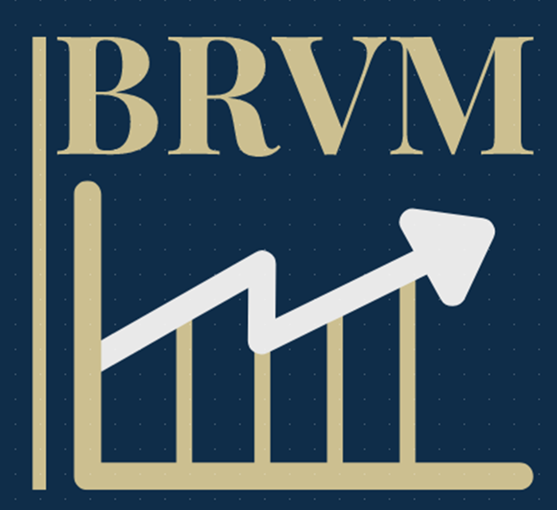
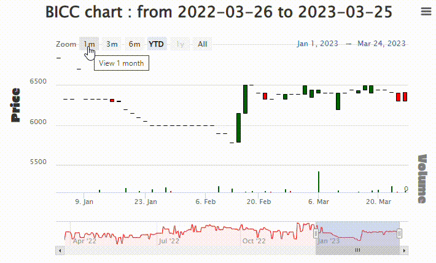
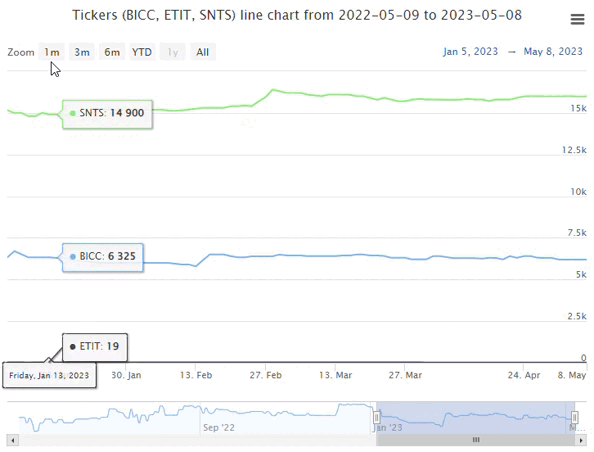

<!-- README.md is generated from README.Rmd. Please edit that file -->




<!-- badges: start -->
[](https://cran.r-project.org/package=BRVM)


[](https://lifecycle.r-lib.org/articles/stages.html##experimental)
[](https://makeapullrequest.com)
<!-- badges: end -->

## BRVM
### Description {.tabset}
#### English
This R package provides a user-friendly interface for accessing data from the BRVM, which is a regional stock exchange serving multiple West African countries. With this package, users can easily retrieve historical stock price data, trading volumes, and other financial indicators for a variety of stocks traded on the BRVM.

The package is designed to simplify the process of gathering and analyzing financial data, making it easier for researchers, investors, and other users to extract insights and make informed decisions based on the information available. Overall, `BRVM` library is a valuable tool for anyone looking to gain a better understanding of the BRVM and the financial markets in West Africa.

#### Français
Ce package R fournit une interface conviviale pour accéder aux données de la BRVM, qui est une bourse régionale desservant plusieurs pays d'Afrique de l'Ouest. Avec ce package, les utilisateurs peuvent facilement récupérer des données historiques sur les prix des actions, les volumes de transactions et d'autres indicateurs financiers pour une variété d'actions négociées sur la BRVM.

Le package est conçu pour simplifier le processus de collecte et d'analyse de données financières, ce qui facilite la tâche des chercheurs, des investisseurs et d'autres utilisateurs pour extraire des informations et prendre des décisions éclairées en se basant sur les informations disponibles. Dans l'ensemble, notre package R est un outil précieux pour quiconque cherche à mieux comprendre la BRVM et les marchés financiers en Afrique de l'Ouest.

## Installation guidelines


You can install using CRAN version


```r
install.packages("BRVM")
```


You can install the development version of BRVM from [github](https://github.com/Koffi-Fredysessie/BRVM) with:


```r
# github dev version
## We can use devtools
# install.packages("devtools")
devtools::install_github("Koffi-Fredysessie/BRVM")

# Or use remotes
# install.packages("remotes")
remotes::install_github("Koffi-Fredysessie/BRVM")
```

## Html version of the Readme 
Since the size of the readme is huge due to the charts, you can visit the html version of the readme on [RPubs](https://rpubs.com/Fredysessie/Readme_BRVM_Stock)


```r
library(BRVM)
```


## The **BRVM_ticker_desc()** function
 
It receives no argument and returns BRVM tickers information such as its full name, sector and country.


```r
# Display tickers of BRVM
tickers <- BRVM_ticker_desc()
tickers
```
<table class="table table-striped" style="margin-left: auto; margin-right: auto;">
 <thead>
  <tr>
   <th style="text-align:left;"> Ticker </th>
   <th style="text-align:left;"> Company name </th>
   <th style="text-align:left;"> Sector </th>
   <th style="text-align:left;"> Country </th>
  </tr>
 </thead>
<tbody>
  <tr>
   <td style="text-align:left;"> ABJC </td>
   <td style="text-align:left;"> SERVAIR ABIDJAN  COTE D'IVOIRE </td>
   <td style="text-align:left;"> DISTRIBUTION </td>
   <td style="text-align:left;"> IVORY COAST </td>
  </tr>
  <tr>
   <td style="text-align:left;"> BICB </td>
   <td style="text-align:left;"> BANQUE INTERNATIONALE POUR L’INDUSTRIE ET LE COMMERCE DU BENIN </td>
   <td style="text-align:left;"> NA </td>
   <td style="text-align:left;"> NA </td>
  </tr>
  <tr>
   <td style="text-align:left;"> BICC </td>
   <td style="text-align:left;"> BICI COTE D'IVOIRE </td>
   <td style="text-align:left;"> FINANCE </td>
   <td style="text-align:left;"> IVORY COAST </td>
  </tr>
  <tr>
   <td style="text-align:left;"> BNBC </td>
   <td style="text-align:left;"> BERNABE COTE D'IVOIRE </td>
   <td style="text-align:left;"> DISTRIBUTION </td>
   <td style="text-align:left;"> IVORY COAST </td>
  </tr>
  <tr>
   <td style="text-align:left;"> BOAB </td>
   <td style="text-align:left;"> BANK OF AFRICA BENIN </td>
   <td style="text-align:left;"> FINANCE </td>
   <td style="text-align:left;"> BENIN </td>
  </tr>
  <tr>
   <td style="text-align:left;"> BOABF </td>
   <td style="text-align:left;"> BANK OF AFRICA BURKINA FASO </td>
   <td style="text-align:left;"> FINANCE </td>
   <td style="text-align:left;"> BURKINA FASO </td>
  </tr>
  <tr>
   <td style="text-align:left;"> BOAC </td>
   <td style="text-align:left;"> BANK OF AFRICA COTE D'IVOIRE </td>
   <td style="text-align:left;"> FINANCE </td>
   <td style="text-align:left;"> IVORY COAST </td>
  </tr>
  <tr>
   <td style="text-align:left;"> BOAM </td>
   <td style="text-align:left;"> BANK OF AFRICA MALI </td>
   <td style="text-align:left;"> FINANCE </td>
   <td style="text-align:left;"> MALI </td>
  </tr>
  <tr>
   <td style="text-align:left;"> BOAN </td>
   <td style="text-align:left;"> BANK OF AFRICA NIGER </td>
   <td style="text-align:left;"> FINANCE </td>
   <td style="text-align:left;"> NIGER </td>
  </tr>
  <tr>
   <td style="text-align:left;"> BOAS </td>
   <td style="text-align:left;"> BANK OF AFRICA SENEGAL </td>
   <td style="text-align:left;"> FINANCE </td>
   <td style="text-align:left;"> SENEGAL </td>
  </tr>
  <tr>
   <td style="text-align:left;"> CABC </td>
   <td style="text-align:left;"> SICABLE COTE D'IVOIRE </td>
   <td style="text-align:left;"> INDUSTRY </td>
   <td style="text-align:left;"> IVORY COAST </td>
  </tr>
  <tr>
   <td style="text-align:left;"> CBIBF </td>
   <td style="text-align:left;"> CORIS BANK INTERNATIONAL BURKINA FASO </td>
   <td style="text-align:left;"> FINANCE </td>
   <td style="text-align:left;"> BURKINA FASO </td>
  </tr>
  <tr>
   <td style="text-align:left;"> CFAC </td>
   <td style="text-align:left;"> CFAO MOTORS COTE D'IVOIRE </td>
   <td style="text-align:left;"> DISTRIBUTION </td>
   <td style="text-align:left;"> IVORY COAST </td>
  </tr>
  <tr>
   <td style="text-align:left;"> CIEC </td>
   <td style="text-align:left;"> CIE COTE D'IVOIRE </td>
   <td style="text-align:left;"> PUBLIC SERVICE </td>
   <td style="text-align:left;"> IVORY COAST </td>
  </tr>
  <tr>
   <td style="text-align:left;"> ECOC </td>
   <td style="text-align:left;"> ECOBANK COTE D'IVOIRE </td>
   <td style="text-align:left;"> FINANCE </td>
   <td style="text-align:left;"> IVORY COAST </td>
  </tr>
  <tr>
   <td style="text-align:left;"> ETIT </td>
   <td style="text-align:left;"> Ecobank Transnational Incorporated TOGO </td>
   <td style="text-align:left;"> FINANCE </td>
   <td style="text-align:left;"> TOGO </td>
  </tr>
  <tr>
   <td style="text-align:left;"> FTSC </td>
   <td style="text-align:left;"> FILTISAC COTE D'IVOIRE </td>
   <td style="text-align:left;"> INDUSTRY </td>
   <td style="text-align:left;"> IVORY COAST </td>
  </tr>
  <tr>
   <td style="text-align:left;"> LNBB </td>
   <td style="text-align:left;"> LOTERIE NATIONALE DU BENIN </td>
   <td style="text-align:left;"> NA </td>
   <td style="text-align:left;"> NA </td>
  </tr>
  <tr>
   <td style="text-align:left;"> NEIC </td>
   <td style="text-align:left;"> NEI-CEDA COTE D'IVOIRE </td>
   <td style="text-align:left;"> INDUSTRY </td>
   <td style="text-align:left;"> IVORY COAST </td>
  </tr>
  <tr>
   <td style="text-align:left;"> NSBC </td>
   <td style="text-align:left;"> NSIA BANQUE COTE D'IVOIRE </td>
   <td style="text-align:left;"> FINANCE </td>
   <td style="text-align:left;"> IVORY COAST </td>
  </tr>
  <tr>
   <td style="text-align:left;"> NTLC </td>
   <td style="text-align:left;"> NESTLE COTE D'IVOIRE </td>
   <td style="text-align:left;"> INDUSTRY </td>
   <td style="text-align:left;"> IVORY COAST </td>
  </tr>
  <tr>
   <td style="text-align:left;"> ONTBF </td>
   <td style="text-align:left;"> ONATEL BURKINA FASO </td>
   <td style="text-align:left;"> PUBLIC SERVICE </td>
   <td style="text-align:left;"> BURKINA FASO </td>
  </tr>
  <tr>
   <td style="text-align:left;"> ORAC </td>
   <td style="text-align:left;"> ORANGE COTE D'IVOIRE </td>
   <td style="text-align:left;"> PUBLIC SERVICE </td>
   <td style="text-align:left;"> IVORY COAST </td>
  </tr>
  <tr>
   <td style="text-align:left;"> ORGT </td>
   <td style="text-align:left;"> ORAGROUP TOGO </td>
   <td style="text-align:left;"> FINANCE </td>
   <td style="text-align:left;"> TOGO </td>
  </tr>
  <tr>
   <td style="text-align:left;"> PALC </td>
   <td style="text-align:left;"> PALM COTE D'IVOIRE </td>
   <td style="text-align:left;"> AGRICULTURE </td>
   <td style="text-align:left;"> IVORY COAST </td>
  </tr>
  <tr>
   <td style="text-align:left;"> PRSC </td>
   <td style="text-align:left;"> TRACTAFRIC MOTORS COTE D'IVOIRE </td>
   <td style="text-align:left;"> DISTRIBUTION </td>
   <td style="text-align:left;"> IVORY COAST </td>
  </tr>
  <tr>
   <td style="text-align:left;"> SAFC </td>
   <td style="text-align:left;"> SAFCA COTE D'IVOIRE </td>
   <td style="text-align:left;"> FINANCE </td>
   <td style="text-align:left;"> IVORY COAST </td>
  </tr>
  <tr>
   <td style="text-align:left;"> SCRC </td>
   <td style="text-align:left;"> SUCRIVOIRE COTE D'IVOIRE </td>
   <td style="text-align:left;"> AGRICULTURE </td>
   <td style="text-align:left;"> IVORY COAST </td>
  </tr>
  <tr>
   <td style="text-align:left;"> SDCC </td>
   <td style="text-align:left;"> SODE COTE D'IVOIRE </td>
   <td style="text-align:left;"> PUBLIC SERVICE </td>
   <td style="text-align:left;"> IVORY COAST </td>
  </tr>
  <tr>
   <td style="text-align:left;"> SDSC </td>
   <td style="text-align:left;"> AFRICA GLOBAL LOGISTICS COTE D'IVOIRE </td>
   <td style="text-align:left;"> TRANSPORT </td>
   <td style="text-align:left;"> IVORY COAST </td>
  </tr>
  <tr>
   <td style="text-align:left;"> SEMC </td>
   <td style="text-align:left;"> EVIOSYS PACKAGING SIEM COTE D'IVOIRE </td>
   <td style="text-align:left;"> INDUSTRY </td>
   <td style="text-align:left;"> IVORY COAST </td>
  </tr>
  <tr>
   <td style="text-align:left;"> SGBC </td>
   <td style="text-align:left;"> SOCIETE GENERALE COTE D'IVOIRE </td>
   <td style="text-align:left;"> FINANCE </td>
   <td style="text-align:left;"> IVORY COAST </td>
  </tr>
  <tr>
   <td style="text-align:left;"> SHEC </td>
   <td style="text-align:left;"> VIVO ENERGY COTE D'IVOIRE </td>
   <td style="text-align:left;"> DISTRIBUTION </td>
   <td style="text-align:left;"> IVORY COAST </td>
  </tr>
  <tr>
   <td style="text-align:left;"> SIBC </td>
   <td style="text-align:left;"> SOCIETE IVOIRIENNE DE BANQUE COTE D'IVOIRE </td>
   <td style="text-align:left;"> FINANCE </td>
   <td style="text-align:left;"> IVORY COAST </td>
  </tr>
  <tr>
   <td style="text-align:left;"> SICC </td>
   <td style="text-align:left;"> SICOR COTE D'IVOIRE </td>
   <td style="text-align:left;"> AGRICULTURE </td>
   <td style="text-align:left;"> IVORY COAST </td>
  </tr>
  <tr>
   <td style="text-align:left;"> SIVC </td>
   <td style="text-align:left;"> AIR LIQUIDE COTE D'IVOIRE </td>
   <td style="text-align:left;"> INDUSTRY </td>
   <td style="text-align:left;"> IVORY COAST </td>
  </tr>
  <tr>
   <td style="text-align:left;"> SLBC </td>
   <td style="text-align:left;"> SOLIBRA COTE D'IVOIRE </td>
   <td style="text-align:left;"> INDUSTRY </td>
   <td style="text-align:left;"> IVORY COAST </td>
  </tr>
  <tr>
   <td style="text-align:left;"> SMBC </td>
   <td style="text-align:left;"> SMB COTE D'IVOIRE </td>
   <td style="text-align:left;"> INDUSTRY </td>
   <td style="text-align:left;"> IVORY COAST </td>
  </tr>
  <tr>
   <td style="text-align:left;"> SNTS </td>
   <td style="text-align:left;"> SONATEL SENEGAL </td>
   <td style="text-align:left;"> PUBLIC SERVICE </td>
   <td style="text-align:left;"> SENEGAL </td>
  </tr>
  <tr>
   <td style="text-align:left;"> SOGC </td>
   <td style="text-align:left;"> SOGB COTE D'IVOIRE </td>
   <td style="text-align:left;"> AGRICULTURE </td>
   <td style="text-align:left;"> IVORY COAST </td>
  </tr>
  <tr>
   <td style="text-align:left;"> SPHC </td>
   <td style="text-align:left;"> SAPH COTE D'IVOIRE </td>
   <td style="text-align:left;"> AGRICULTURE </td>
   <td style="text-align:left;"> IVORY COAST </td>
  </tr>
  <tr>
   <td style="text-align:left;"> STAC </td>
   <td style="text-align:left;"> SETAO COTE D'IVOIRE </td>
   <td style="text-align:left;"> OTHER </td>
   <td style="text-align:left;"> IVORY COAST </td>
  </tr>
  <tr>
   <td style="text-align:left;"> STBC </td>
   <td style="text-align:left;"> SITAB COTE D'IVOIRE </td>
   <td style="text-align:left;"> INDUSTRY </td>
   <td style="text-align:left;"> IVORY COAST </td>
  </tr>
  <tr>
   <td style="text-align:left;"> TTLC </td>
   <td style="text-align:left;"> TOTALENERGIES MARKETING COTE D'IVOIRE </td>
   <td style="text-align:left;"> DISTRIBUTION </td>
   <td style="text-align:left;"> IVORY COAST </td>
  </tr>
  <tr>
   <td style="text-align:left;"> TTLS </td>
   <td style="text-align:left;"> TOTALENERGIES MARKETING SENEGAL </td>
   <td style="text-align:left;"> DISTRIBUTION </td>
   <td style="text-align:left;"> SENEGAL </td>
  </tr>
  <tr>
   <td style="text-align:left;"> UNLC </td>
   <td style="text-align:left;"> UNILEVER COTE D'IVOIRE </td>
   <td style="text-align:left;"> INDUSTRY </td>
   <td style="text-align:left;"> IVORY COAST </td>
  </tr>
  <tr>
   <td style="text-align:left;"> UNXC </td>
   <td style="text-align:left;"> UNIWAX COTE D'IVOIRE </td>
   <td style="text-align:left;"> INDUSTRY </td>
   <td style="text-align:left;"> IVORY COAST </td>
  </tr>
</tbody>
</table>


## The **BRVM_index()** function :
It receives no argument and returns a table of updated data (with as table header: indexes, previous closing, closing, change (%), Year to Date Change) on all the indices available on the BRVM exchange.


```r
the_index <- BRVM_index() 
the_index
```
<table class="table table-striped" style="margin-left: auto; margin-right: auto;">
<tbody>
  <tr>

  </tr>
</tbody>
</table>


## The **BRVM_get(".symbol", ".from", ".to")** function
 
This function will get the data of the companies listed on the BVRM stock exchange in Rich Bourse website. The function takes a single parameter, `.symbol` (which represents the "Ticker").
The function will automatically format tickers you enter in uppercase using toupper() and then ensure that the passed ticker is in a Google spreadsheet of allowed tickers.

* .symbol : A vector of symbols, like: c("BICC","XOM","SlbC") ;
* .from : A quoted start date, ie. "2020-01-01" or "2020/01/01". The date must be in ymd format "YYYY-MM-DD" or "YYYY/MM/DD" ;
* .to : A quoted end date, ie. "2022-01-31" or "2022/01/31". The date must be in ymd format "YYYY-MM-DD" or "YYYY/MM/DD".


```r

#' Displaying data of SONATEL Senegal stock
BRVM_get(.symbol = "snts")
#> # A tibble: 247 × 6
#>    Date        Open  High   Low Close Volume
#>    <date>     <dbl> <dbl> <dbl> <dbl>  <dbl>
#>  1 2024-07-22 20510 20900 20500 20500   5606
#>  2 2024-07-23 20500 20500 20310 20310   4199
#>  3 2024-07-24 20400 20400 20310 20370   2703
#>  4 2024-07-25 20370 20400 20370 20400   4854
#>  5 2024-07-26 20370 20500 20305 20500   1229
#>  6 2024-07-29 20600 20700 20250 20700   4447
#>  7 2024-07-30 20700 20700 20505 20690   1412
#>  8 2024-07-31 20695 21000 20690 20700   8267
#>  9 2024-08-01 20700 20700 20550 20600  11003
#> 10 2024-08-02 20700 21000 20600 20600  25180
#> # ℹ 237 more rows

symbols <- c("BiCc","XOM","SlbC")   # We use here three tickers
data_tbl <- BRVM_get(.symbol = symbols, .from = "2020-01-01", .to = Sys.Date() - 1)

# Display the first twenty observations of the table
head(data_tbl, 20)
#> # A tibble: 20 × 7
#>    Date        Open  High   Low Close Volume Ticker
#>    <date>     <dbl> <dbl> <dbl> <dbl>  <dbl> <chr> 
#>  1 2020-01-10  6500  6500  6500  6500     24 BICC  
#>  2 2020-01-13  6370  6500  6370  6500     29 BICC  
#>  3 2020-01-14  6495  6495  6495  6495     10 BICC  
#>  4 2020-01-29  6010  6010  6010  6010     24 BICC  
#>  5 2020-01-30  6000  6000  6000  6000     50 BICC  
#>  6 2020-02-04  5800  5800  5800  5800     12 BICC  
#>  7 2020-02-07  5650  5650  5650  5650      5 BICC  
#>  8 2020-02-10  5500  5500  5500  5500      5 BICC  
#>  9 2020-02-14  5300  5300  5300  5300      9 BICC  
#> 10 2020-02-17  4910  4910  4910  4910    210 BICC  
#> 11 2020-02-18  4910  4910  4910  4910     50 BICC  
#> 12 2020-02-20  4895  4895  4895  4895      5 BICC  
#> 13 2020-02-21  4895  4895  4890  4890     13 BICC  
#> 14 2020-02-25  4525  4525  4525  4525     16 BICC  
#> 15 2020-02-26  4435  4435  4430  4430     21 BICC  
#> 16 2020-02-27  4345  4760  4335  4760   1809 BICC  
#> 17 2020-03-03  4745  4750  4745  4750     11 BICC  
#> 18 2020-03-05  4700  4700  4700  4700      5 BICC  
#> 19 2020-03-06  4695  4695  4695  4695      6 BICC  
#> 20 2020-03-11  4345  4450  4345  4450    135 BICC


# Display the last twenty elements of the table
tail(data_tbl, 20)
#> # A tibble: 20 × 7
#>    Date        Open  High   Low Close Volume Ticker
#>    <date>     <dbl> <dbl> <dbl> <dbl>  <dbl> <chr> 
#>  1 2025-06-23 18375 18500 18040 18040     49 SLBC  
#>  2 2025-06-24 18375 18375 18040 18040      8 SLBC  
#>  3 2025-06-25 18400 18700 17500 18000    110 SLBC  
#>  4 2025-06-26 19200 19295 16800 16800   8201 SLBC  
#>  5 2025-06-27 18000 18000 16800 16815     34 SLBC  
#>  6 2025-06-30 16815 16820 16815 16820     11 SLBC  
#>  7 2025-07-01 16900 17290 16820 16820    144 SLBC  
#>  8 2025-07-02 16820 17290 16800 17290     34 SLBC  
#>  9 2025-07-03 17290 17975 17290 17975    183 SLBC  
#> 10 2025-07-04 18000 19320 17975 19320     90 SLBC  
#> 11 2025-07-07 19320 19320 19315 19315     27 SLBC  
#> 12 2025-07-08 19310 19315 17870 17870     72 SLBC  
#> 13 2025-07-09 17870 17870 17000 17000     75 SLBC  
#> 14 2025-07-10 17870 17870 17000 17000    112 SLBC  
#> 15 2025-07-11 17870 18275 17000 18275     82 SLBC  
#> 16 2025-07-14 19195 19320 18200 19320    231 SLBC  
#> 17 2025-07-15 19320 19320 18950 19000   1448 SLBC  
#> 18 2025-07-16 19000 19000 18950 18950    260 SLBC  
#> 19 2025-07-17 19000 19320 18300 18300    351 SLBC  
#> 20 2025-07-18 18350 18400 18300 18400     40 SLBC
```

## The **BRVM_get1("ticker ", "Period", "from", "to")** function

This function will get data of the companies listed on the BVRM stock exchange through the sikafinance site.
The function takes in a single parameter of ticker and will auto-format the tickers you input into all upper case by using `toupper()`

* ticker : A vector of ticker, like: c("BICC","XOM","SlbC", "BRvm10");
* Period : Numeric number indicating time period. Valid entries are 0, 1, 5, 30, 91, and 365 representing respectively 'daily', 'one year', 'weekly', 'monthly', 'quarterly' and 'yearly';
* from : A quoted start date, ie. "2020-01-01" or "2020/01/01". The date must be in ymd format "YYYY-MM-DD" or "YYYY/MM/DD";
* to : A quoted end date, ie. "2022-01-31" or "2022/01/31". The date must be in ymd format "YYYY-MM-DD" or "YYYY/MM/DD"

** NB : There is a small difference between the BRVM_get and BRVM_get1 functions.
* With BRVM_get it is only possible to download tickers' daily data.
* But with BRVM_get1, you can download daily, weekly, monthly, annual tickers’ data, indices and even market capitalization.


```r
#' Displaying data of SONATEL Senegal stock
BRVM_get1("snts")
#> # A tibble: 62 × 5
#>    Date        Open  High   Low Close
#>    <date>     <int> <int> <int> <int>
#>  1 2025-04-22 24500 24500 24000 24000
#>  2 2025-04-23 24935 24935 24900 24900
#>  3 2025-04-24 24900 24900 24500 24500
#>  4 2025-04-25 24500 24850 24500 24850
#>  5 2025-04-28 24900 24900 24900 24900
#>  6 2025-04-29 24900 24990 24900 24990
#>  7 2025-04-30 24990 25100 24990 25100
#>  8 2025-05-01 24990 25100 24990 25100
#>  9 2025-05-02 25500 25895 25500 25895
#> 10 2025-05-05 25605 26000 25605 26000
#> # ℹ 52 more rows

# Get daily data of all indexes
all_ind <- BRVM_get1("ALL INDEXES", Period = 0, from = "2020-01-04", to = "2023-03-24") 

# display the first two tens elements of the table
head(all_ind, 20)
#> # A tibble: 20 × 7
#>    Date        Open  High   Low Close Volume Ticker
#>    <date>     <dbl> <dbl> <dbl> <dbl>  <dbl> <chr> 
#>  1 2022-12-26  293.  293.  293.  293.      0 BRVMAG
#>  2 2022-12-27  292.  292.  292.  292.      0 BRVMAG
#>  3 2022-12-28  285.  285.  285.  285.      0 BRVMAG
#>  4 2022-12-29  285.  285.  285.  285.      0 BRVMAG
#>  5 2022-12-30  284.  284.  284.  284.      0 BRVMAG
#>  6 2023-01-02  283.  283.  283.  283.      0 BRVMAG
#>  7 2023-01-03  281.  281.  281.  281.      0 BRVMAG
#>  8 2023-01-04  275.  275.  275.  275.      0 BRVMAG
#>  9 2023-01-05  279.  279.  279.  279.      0 BRVMAG
#> 10 2023-01-06  269.  269.  269.  269.      0 BRVMAG
#> 11 2023-01-09  276.  276.  276.  276.      0 BRVMAG
#> 12 2023-01-10  276.  276.  276.  276.      0 BRVMAG
#> 13 2023-01-11  276.  276.  276.  276.      0 BRVMAG
#> 14 2023-01-12  275.  275.  275.  275.      0 BRVMAG
#> 15 2023-01-13  275.  275.  275.  275.      0 BRVMAG
#> 16 2023-01-16  273.  273.  273.  273.      0 BRVMAG
#> 17 2023-01-17  273.  273.  273.  273.      0 BRVMAG
#> 18 2023-01-18  271.  271.  271.  271.      0 BRVMAG
#> 19 2023-01-19  281.  281.  281.  281.      0 BRVMAG
#> 20 2023-01-20  281.  281.  281.  281.      0 BRVMAG

# display the two tens of the last elements of the table
tail(all_ind, 20)
#> # A tibble: 20 × 7
#>    Date          Open    High     Low   Close Volume Ticker
#>    <date>       <dbl>   <dbl>   <dbl>   <dbl>  <dbl> <chr> 
#>  1 2020-02-26 4281311 4281311 4281311 4281311      0 CAPIB 
#>  2 2020-02-27 4314933 4314933 4314933 4314933      0 CAPIB 
#>  3 2020-02-28 4346515 4346515 4346515 4346515      0 CAPIB 
#>  4 2020-03-02 4424073 4424073 4424073 4424073      0 CAPIB 
#>  5 2020-03-03 4379647 4379647 4379647 4379647      0 CAPIB 
#>  6 2020-03-04 4369550 4369550 4369550 4369550      0 CAPIB 
#>  7 2020-03-05 4342229 4342229 4342229 4342229      0 CAPIB 
#>  8 2020-03-06 4359879 4359879 4359879 4359879      0 CAPIB 
#>  9 2020-03-09 4338293 4338293 4338293 4338293      0 CAPIB 
#> 10 2020-03-10 4357221 4357221 4357221 4357221      0 CAPIB 
#> 11 2020-03-11 4332656 4332656 4332656 4332656      0 CAPIB 
#> 12 2020-03-12 4318096 4318096 4318096 4318096      0 CAPIB 
#> 13 2020-03-13 4318112 4318112 4318112 4318112      0 CAPIB 
#> 14 2020-03-16 4285184 4285184 4285184 4285184      0 CAPIB 
#> 15 2020-03-17 4301727 4301727 4301727 4301727      0 CAPIB 
#> 16 2020-03-18 4288582 4288582 4288582 4288582      0 CAPIB 
#> 17 2020-03-19 4207231 4207231 4207231 4207231      0 CAPIB 
#> 18 2020-03-20 4209788 4209788 4209788 4209788      0 CAPIB 
#> 19 2020-03-23 4154445 4154445 4154445 4154445      0 CAPIB 
#> 20 2020-03-24 4144325 4144325 4144325 4144325      0 CAPIB

# To get yearly data
yearly_data <- BRVM_get1(c("brvmtr", "BiCc", "BOAS"), Period = 365 ) 

# display the first two tens elements of the table
head(yearly_data, 20) 
#> # A tibble: 20 × 6
#>    Date        Open  High    Low Close Ticker
#>    <date>     <dbl> <dbl>  <dbl> <dbl> <chr> 
#>  1 2005-07-25  101.  104.   99.2  104. BRVMTR
#>  2 2006-01-02  104.  158.  104.   153. BRVMTR
#>  3 2007-01-02  153.  275.  149.   249. BRVMTR
#>  4 2008-01-02  249.  386.  226.   296. BRVMTR
#>  5 2009-01-02  275.  296.  227.   236. BRVMTR
#>  6 2010-01-04  236.  259.  224.   238. BRVMTR
#>  7 2011-01-03  238.  249.  204.   239  BRVMTR
#>  8 2012-01-02  239   349.  201.   349. BRVMTR
#>  9 2013-01-02  349.  794.  339.   789. BRVMTR
#> 10 2014-01-02  789. 1213.  601.  1213. BRVMTR
#> 11 2015-01-02 1213. 1525.  653.  1525. BRVMTR
#> 12 2016-01-04 1525. 1525. 1216.  1432. BRVMTR
#> 13 2017-01-02 1432. 1433.  764.  1203. BRVMTR
#> 14 2018-01-02 1114. 1193.  966.   966. BRVMTR
#> 15 2019-06-03  403.  429.  311.   367. BRVMTR
#> 16 2020-01-01  367.  475.  292.   379. BRVMTR
#> 17 2021-01-04  376.  622.  325    622. BRVMTR
#> 18 2022-01-03  667.  667.  295.   342. BRVMTR
#> 19 2023-01-02  341.  414.  307.   331. BRVMTR
#> 20 2024-01-01  331.  414.  302.   326. BRVMTR

# display the two tens of the last elements of the table
tail(yearly_data, 20) 
#> # A tibble: 20 × 6
#>    Date         Open   High    Low  Close Ticker
#>    <date>      <dbl>  <dbl>  <dbl>  <dbl> <chr> 
#>  1 2018-01-02  8700   8750   3795   7900  BICC  
#>  2 2019-01-04  7550   7550   3710   6800  BICC  
#>  3 2020-01-01  6800   6890   2855   6680  BICC  
#>  4 2021-01-04  6680   7525   4280   7400  BICC  
#>  5 2022-01-03  7250   7250   5550   6850  BICC  
#>  6 2023-01-02  6500   7495   5785   7490  BICC  
#>  7 2024-01-04  7450  14225   6800  14000  BICC  
#>  8 2025-01-01 14000  18220  13655  16845  BICC  
#>  9 2014-12-10  1075.  2150   1075.  2150  BOAS  
#> 10 2015-01-02  2247.  2867.  1933.  2633. BOAS  
#> 11 2016-01-04  2467.  2734   1333.  1567. BOAS  
#> 12 2017-01-02  1550   2583.  1357.  1667. BOAS  
#> 13 2018-01-02  1600   2167.  1133.  1347. BOAS  
#> 14 2019-01-02  1267.  1333.  1000   1030  BOAS  
#> 15 2020-01-01  1033.  1133.   863.   997. BOAS  
#> 16 2021-01-04   987.  1833.   893.  1567. BOAS  
#> 17 2022-01-03  1567.  1853.  1467.  1633. BOAS  
#> 18 2023-01-02  1720   2433.  1450   2133. BOAS  
#> 19 2024-01-01  2133.  4175   2000   3150  BOAS  
#> 20 2025-01-01  3150   4470   2550   4470  BOAS
```

## The **BRVM.index()** function :
It receives no argument and returns the name of all indexes available on BRVM Stock Exchange.


```r
BRVM.index()
#>  [1] "BRVMAG" "BRVMC"  "BRVMAS" "BRVMDI" "BRVMFI" "BRVMIN" "BRVMSP" "BRVMTR"
#>  [9] "BRVMPR" "BRVMPA" "BRVM30"
```


 
## The **BRVM_bySector(".sectors")** function :
 
This function will take in the name of sector(s) and returns data for companies belonging to that/those sector(s)

* .sectors : A vector of sectors you wish to have returned.


```r
# Get informations about brvm sectors like other and agriculture sectors
BRVM_bySector(.sectors = c("Other", "Agriculture"))
```

 
## The **BRVM_stock_market(".weekday")** function :
This function receives as input a day of the week (working day) and returns the official quotation revews of that day.
* .weekday : A quoted date, ie. "2022-01-31" or "2022/01/31". The date must be in ymd format "YYYY-MM-DD" or "YYYY/MM/DD". Must not be a weekend or a holiday.


```r
# The BOC of 2022-02-23
BRVM_stock_market("2022-02-23")
```

 
## The **BRVM_plot(".company",  "up.col", "down.col")** function:
 This function will get Ticker(s) data and then plot it.

* .company : is the Ticker(s) name(s)
* from : A quoted start date, ie. "2020-01-01" or "2020/01/01". The date must be in ymd format "YYYY-MM-DD" or "YYYY/MM/DD".
* to : A quoted end date, ie. "2022-01-31" or "2022/01/31". The date must be in ymd format "YYYY-MM-DD" or "YYYY/MM/DD"
* up.col	 : is the up color
* down.col : is down color


  

```r

chart <- BRVM_plot("BICC") # The default colors for the up and down are green and 

#chart
```

<div align="center"> 
  


</div>


```r
#It is also possible to plot stock data chart for more than one ticker
#Let's plot BICC, ETIT and BOAM stock data

chart1 <- BRVM_plot(c("BICC","ETIT", "BOAM"))

# chart1
```

<div align="center"> 



</div>


> - `BRVM_plot` : For one ticker, you can also specify your color like 
* `BRVM_plot("boas", up.col = "blue", down.col = "pink")` for example


## The **BRVM_company_info("ticker")** function

It receives the ticker of a company listed on the BRVM stock exchange, Turn to upper case the input by using toupper() and returns informations about the company's RSI, Beta, Closing price, etc. .


```r

# Get informations such us beta, RSI, Closing, Valorisation, etc. of Bank Of Africa Senegal
inform <- BRVM_company_info("BOAS")
inform
```

<table class="table table-striped" style="margin-left: auto; margin-right: auto;">
<tbody>
  <tr>

  </tr>
</tbody>
</table>

> - **BRVM_cap()** : receives no argument and returns informations about BRVM capitalization


```r
capit_ <- BRVM_cap()
capit_
```


<table class="table table-striped" style="margin-left: auto; margin-right: auto;">
<tbody>
  <tr>

  </tr>
</tbody>
</table>

> - **BRVM_company_rank()** : returns companies rank from the BRVM Bourse exchange according to their daily change (variation).


```r
comp.rank <- BRVM_company_rank() #Get companies rank
comp.rank <- comp.rank%>%
    arrange(desc(percent_change)) #Describe in decreasing order

comp.rank
```

<table class="table table-striped" style="margin-left: auto; margin-right: auto;">
 <thead>
  <tr>
   <th style="text-align:left;"> ticker </th>
   <th style="text-align:left;"> company_name </th>
   <th style="text-align:right;"> percent_change </th>
   <th style="text-align:right;"> rank </th>
  </tr>
 </thead>
<tbody>
  <tr>
   <td style="text-align:left;"> UNLC </td>
   <td style="text-align:left;"> UNILEVER COTE D'IVOIRE </td>
   <td style="text-align:right;"> 7.50 </td>
   <td style="text-align:right;"> 1 </td>
  </tr>
  <tr>
   <td style="text-align:left;"> CIEC </td>
   <td style="text-align:left;"> CIE COTE D'IVOIRE </td>
   <td style="text-align:right;"> 7.33 </td>
   <td style="text-align:right;"> 2 </td>
  </tr>
  <tr>
   <td style="text-align:left;"> SDCC </td>
   <td style="text-align:left;"> SODE COTE D'IVOIRE </td>
   <td style="text-align:right;"> 7.26 </td>
   <td style="text-align:right;"> 3 </td>
  </tr>
  <tr>
   <td style="text-align:left;"> SMBC </td>
   <td style="text-align:left;"> SMB COTE D'IVOIRE </td>
   <td style="text-align:right;"> 3.92 </td>
   <td style="text-align:right;"> 4 </td>
  </tr>
  <tr>
   <td style="text-align:left;"> BNBC </td>
   <td style="text-align:left;"> BERNABE COTE D'IVOIRE </td>
   <td style="text-align:right;"> 3.46 </td>
   <td style="text-align:right;"> 5 </td>
  </tr>
  <tr>
   <td style="text-align:left;"> SOGC </td>
   <td style="text-align:left;"> SOGB COTE D'IVOIRE </td>
   <td style="text-align:right;"> 2.96 </td>
   <td style="text-align:right;"> 6 </td>
  </tr>
  <tr>
   <td style="text-align:left;"> ORGT </td>
   <td style="text-align:left;"> ORAGROUP TOGO </td>
   <td style="text-align:right;"> 2.50 </td>
   <td style="text-align:right;"> 7 </td>
  </tr>
  <tr>
   <td style="text-align:left;"> FTSC </td>
   <td style="text-align:left;"> FILTISAC COTE D'IVOIRE </td>
   <td style="text-align:right;"> 1.63 </td>
   <td style="text-align:right;"> 8 </td>
  </tr>
  <tr>
   <td style="text-align:left;"> SPHC </td>
   <td style="text-align:left;"> SAPH COTE D'IVOIRE </td>
   <td style="text-align:right;"> 1.45 </td>
   <td style="text-align:right;"> 9 </td>
  </tr>
  <tr>
   <td style="text-align:left;"> STBC </td>
   <td style="text-align:left;"> SITAB COTE D'IVOIRE </td>
   <td style="text-align:right;"> 1.37 </td>
   <td style="text-align:right;"> 10 </td>
  </tr>
  <tr>
   <td style="text-align:left;"> SNTS </td>
   <td style="text-align:left;"> SONATEL SENEGAL </td>
   <td style="text-align:right;"> 0.79 </td>
   <td style="text-align:right;"> 11 </td>
  </tr>
  <tr>
   <td style="text-align:left;"> BOAS </td>
   <td style="text-align:left;"> BANK OF AFRICA SENEGAL </td>
   <td style="text-align:right;"> 0.68 </td>
   <td style="text-align:right;"> 12 </td>
  </tr>
  <tr>
   <td style="text-align:left;"> PALC </td>
   <td style="text-align:left;"> PALM COTE D'IVOIRE </td>
   <td style="text-align:right;"> 0.61 </td>
   <td style="text-align:right;"> 13 </td>
  </tr>
  <tr>
   <td style="text-align:left;"> ABJC </td>
   <td style="text-align:left;"> SERVAIR ABIDJAN  COTE D'IVOIRE </td>
   <td style="text-align:right;"> 0.59 </td>
   <td style="text-align:right;"> 14 </td>
  </tr>
  <tr>
   <td style="text-align:left;"> SLBC </td>
   <td style="text-align:left;"> SOLIBRA COTE D'IVOIRE </td>
   <td style="text-align:right;"> 0.55 </td>
   <td style="text-align:right;"> 15 </td>
  </tr>
  <tr>
   <td style="text-align:left;"> CBIBF </td>
   <td style="text-align:left;"> CORIS BANK INTERNATIONAL BURKINA FASO </td>
   <td style="text-align:right;"> 0.46 </td>
   <td style="text-align:right;"> 16 </td>
  </tr>
  <tr>
   <td style="text-align:left;"> BICB </td>
   <td style="text-align:left;"> BANQUE INTERNATIONALE POUR L’INDUSTRIE ET LE COMMERCE DU BENIN </td>
   <td style="text-align:right;"> 0.29 </td>
   <td style="text-align:right;"> 17 </td>
  </tr>
  <tr>
   <td style="text-align:left;"> SGBC </td>
   <td style="text-align:left;"> SOCIETE GENERALE COTE D'IVOIRE </td>
   <td style="text-align:right;"> 0.20 </td>
   <td style="text-align:right;"> 18 </td>
  </tr>
  <tr>
   <td style="text-align:left;"> SIBC </td>
   <td style="text-align:left;"> SOCIETE IVOIRIENNE DE BANQUE COTE D'IVOIRE </td>
   <td style="text-align:right;"> 0.10 </td>
   <td style="text-align:right;"> 19 </td>
  </tr>
  <tr>
   <td style="text-align:left;"> BOAB </td>
   <td style="text-align:left;"> BANK OF AFRICA BENIN </td>
   <td style="text-align:right;"> 0.00 </td>
   <td style="text-align:right;"> 26 </td>
  </tr>
  <tr>
   <td style="text-align:left;"> BOAC </td>
   <td style="text-align:left;"> BANK OF AFRICA COTE D'IVOIRE </td>
   <td style="text-align:right;"> 0.00 </td>
   <td style="text-align:right;"> 26 </td>
  </tr>
  <tr>
   <td style="text-align:left;"> CABC </td>
   <td style="text-align:left;"> SICABLE COTE D'IVOIRE </td>
   <td style="text-align:right;"> 0.00 </td>
   <td style="text-align:right;"> 26 </td>
  </tr>
  <tr>
   <td style="text-align:left;"> ETIT </td>
   <td style="text-align:left;"> Ecobank Transnational Incorporated TOGO </td>
   <td style="text-align:right;"> 0.00 </td>
   <td style="text-align:right;"> 26 </td>
  </tr>
  <tr>
   <td style="text-align:left;"> NSBC </td>
   <td style="text-align:left;"> NSIA BANQUE COTE D'IVOIRE </td>
   <td style="text-align:right;"> 0.00 </td>
   <td style="text-align:right;"> 26 </td>
  </tr>
  <tr>
   <td style="text-align:left;"> NTLC </td>
   <td style="text-align:left;"> NESTLE COTE D'IVOIRE </td>
   <td style="text-align:right;"> 0.00 </td>
   <td style="text-align:right;"> 26 </td>
  </tr>
  <tr>
   <td style="text-align:left;"> ORAC </td>
   <td style="text-align:left;"> ORANGE COTE D'IVOIRE </td>
   <td style="text-align:right;"> 0.00 </td>
   <td style="text-align:right;"> 26 </td>
  </tr>
  <tr>
   <td style="text-align:left;"> PRSC </td>
   <td style="text-align:left;"> TRACTAFRIC MOTORS COTE D'IVOIRE </td>
   <td style="text-align:right;"> 0.00 </td>
   <td style="text-align:right;"> 26 </td>
  </tr>
  <tr>
   <td style="text-align:left;"> SCRC </td>
   <td style="text-align:left;"> SUCRIVOIRE COTE D'IVOIRE </td>
   <td style="text-align:right;"> 0.00 </td>
   <td style="text-align:right;"> 26 </td>
  </tr>
  <tr>
   <td style="text-align:left;"> SEMC </td>
   <td style="text-align:left;"> EVIOSYS PACKAGING SIEM COTE D'IVOIRE </td>
   <td style="text-align:right;"> 0.00 </td>
   <td style="text-align:right;"> 26 </td>
  </tr>
  <tr>
   <td style="text-align:left;"> SICC </td>
   <td style="text-align:left;"> SICOR COTE D'IVOIRE </td>
   <td style="text-align:right;"> 0.00 </td>
   <td style="text-align:right;"> 26 </td>
  </tr>
  <tr>
   <td style="text-align:left;"> STAC </td>
   <td style="text-align:left;"> SETAO COTE D'IVOIRE </td>
   <td style="text-align:right;"> 0.00 </td>
   <td style="text-align:right;"> 26 </td>
  </tr>
  <tr>
   <td style="text-align:left;"> UNXC </td>
   <td style="text-align:left;"> UNIWAX COTE D'IVOIRE </td>
   <td style="text-align:right;"> 0.00 </td>
   <td style="text-align:right;"> 26 </td>
  </tr>
  <tr>
   <td style="text-align:left;"> BICC </td>
   <td style="text-align:left;"> BICI COTE D'IVOIRE </td>
   <td style="text-align:right;"> -0.03 </td>
   <td style="text-align:right;"> 33 </td>
  </tr>
  <tr>
   <td style="text-align:left;"> LNBB </td>
   <td style="text-align:left;"> LOTERIE NATIONALE DU BENIN </td>
   <td style="text-align:right;"> -0.11 </td>
   <td style="text-align:right;"> 34 </td>
  </tr>
  <tr>
   <td style="text-align:left;"> BOABF </td>
   <td style="text-align:left;"> BANK OF AFRICA BURKINA FASO </td>
   <td style="text-align:right;"> -0.14 </td>
   <td style="text-align:right;"> 35 </td>
  </tr>
  <tr>
   <td style="text-align:left;"> TTLC </td>
   <td style="text-align:left;"> TOTALENERGIES MARKETING COTE D'IVOIRE </td>
   <td style="text-align:right;"> -0.39 </td>
   <td style="text-align:right;"> 36 </td>
  </tr>
  <tr>
   <td style="text-align:left;"> BOAM </td>
   <td style="text-align:left;"> BANK OF AFRICA MALI </td>
   <td style="text-align:right;"> -0.58 </td>
   <td style="text-align:right;"> 37 </td>
  </tr>
  <tr>
   <td style="text-align:left;"> BOAN </td>
   <td style="text-align:left;"> BANK OF AFRICA NIGER </td>
   <td style="text-align:right;"> -0.59 </td>
   <td style="text-align:right;"> 38 </td>
  </tr>
  <tr>
   <td style="text-align:left;"> SDSC </td>
   <td style="text-align:left;"> AFRICA GLOBAL LOGISTICS COTE D'IVOIRE </td>
   <td style="text-align:right;"> -1.38 </td>
   <td style="text-align:right;"> 39 </td>
  </tr>
  <tr>
   <td style="text-align:left;"> SAFC </td>
   <td style="text-align:left;"> SAFCA COTE D'IVOIRE </td>
   <td style="text-align:right;"> -1.45 </td>
   <td style="text-align:right;"> 40 </td>
  </tr>
  <tr>
   <td style="text-align:left;"> NEIC </td>
   <td style="text-align:left;"> NEI-CEDA COTE D'IVOIRE </td>
   <td style="text-align:right;"> -1.69 </td>
   <td style="text-align:right;"> 41 </td>
  </tr>
  <tr>
   <td style="text-align:left;"> ONTBF </td>
   <td style="text-align:left;"> ONATEL BURKINA FASO </td>
   <td style="text-align:right;"> -1.77 </td>
   <td style="text-align:right;"> 42 </td>
  </tr>
  <tr>
   <td style="text-align:left;"> SHEC </td>
   <td style="text-align:left;"> VIVO ENERGY COTE D'IVOIRE </td>
   <td style="text-align:right;"> -2.40 </td>
   <td style="text-align:right;"> 43 </td>
  </tr>
  <tr>
   <td style="text-align:left;"> TTLS </td>
   <td style="text-align:left;"> TOTALENERGIES MARKETING SENEGAL </td>
   <td style="text-align:right;"> -2.57 </td>
   <td style="text-align:right;"> 44 </td>
  </tr>
  <tr>
   <td style="text-align:left;"> SIVC </td>
   <td style="text-align:left;"> AIR LIQUIDE COTE D'IVOIRE </td>
   <td style="text-align:right;"> -2.86 </td>
   <td style="text-align:right;"> 45 </td>
  </tr>
  <tr>
   <td style="text-align:left;"> CFAC </td>
   <td style="text-align:left;"> CFAO MOTORS COTE D'IVOIRE </td>
   <td style="text-align:right;"> -2.99 </td>
   <td style="text-align:right;"> 46 </td>
  </tr>
  <tr>
   <td style="text-align:left;"> ECOC </td>
   <td style="text-align:left;"> ECOBANK COTE D'IVOIRE </td>
   <td style="text-align:right;"> -5.93 </td>
   <td style="text-align:right;"> 47 </td>
  </tr>
</tbody>
</table>

> - **BRVM_direction(".up_or_down")** : Takes 'Up' or 'Down' and returns respectively n results for the top or flop ranking of the BRVM tickers.

* .up_or_down : This is a character string set to "Up" by default It can either be 'Up' or 'Down'.


```r

# Rank in increasing order the price of shares listed on the BRVM according to daily variations.
brvm_down <- BRVM_direction("Down")
brvm_down
```

<table class="table table-striped" style="margin-left: auto; margin-right: auto;">
 <thead>
  <tr>
   <th style="text-align:left;"> Symbol </th>
   <th style="text-align:left;"> Name </th>
   <th style="text-align:right;"> Variation in percentage </th>
  </tr>
 </thead>
<tbody>
  <tr>
   <td style="text-align:left;"> ECOC </td>
   <td style="text-align:left;"> ECOBANK COTE D'IVOIRE </td>
   <td style="text-align:right;"> -5.93 </td>
  </tr>
  <tr>
   <td style="text-align:left;"> CFAC </td>
   <td style="text-align:left;"> CFAO MOTORS COTE D'IVOIRE </td>
   <td style="text-align:right;"> -2.99 </td>
  </tr>
  <tr>
   <td style="text-align:left;"> SIVC </td>
   <td style="text-align:left;"> AIR LIQUIDE COTE D'IVOIRE </td>
   <td style="text-align:right;"> -2.86 </td>
  </tr>
  <tr>
   <td style="text-align:left;"> TTLS </td>
   <td style="text-align:left;"> TOTALENERGIES MARKETING SENEGAL </td>
   <td style="text-align:right;"> -2.57 </td>
  </tr>
  <tr>
   <td style="text-align:left;"> SHEC </td>
   <td style="text-align:left;"> VIVO ENERGY COTE D'IVOIRE </td>
   <td style="text-align:right;"> -2.40 </td>
  </tr>
  <tr>
   <td style="text-align:left;"> ONTBF </td>
   <td style="text-align:left;"> ONATEL BURKINA FASO </td>
   <td style="text-align:right;"> -1.77 </td>
  </tr>
  <tr>
   <td style="text-align:left;"> NEIC </td>
   <td style="text-align:left;"> NEI-CEDA COTE D'IVOIRE </td>
   <td style="text-align:right;"> -1.69 </td>
  </tr>
  <tr>
   <td style="text-align:left;"> SAFC </td>
   <td style="text-align:left;"> SAFCA COTE D'IVOIRE </td>
   <td style="text-align:right;"> -1.45 </td>
  </tr>
  <tr>
   <td style="text-align:left;"> SDSC </td>
   <td style="text-align:left;"> AFRICA GLOBAL LOGISTICS COTE D'IVOIRE </td>
   <td style="text-align:right;"> -1.38 </td>
  </tr>
  <tr>
   <td style="text-align:left;"> BOAN </td>
   <td style="text-align:left;"> BANK OF AFRICA NIGER </td>
   <td style="text-align:right;"> -0.59 </td>
  </tr>
  <tr>
   <td style="text-align:left;"> BOAM </td>
   <td style="text-align:left;"> BANK OF AFRICA MALI </td>
   <td style="text-align:right;"> -0.58 </td>
  </tr>
  <tr>
   <td style="text-align:left;"> TTLC </td>
   <td style="text-align:left;"> TOTALENERGIES MARKETING COTE D'IVOIRE </td>
   <td style="text-align:right;"> -0.39 </td>
  </tr>
  <tr>
   <td style="text-align:left;"> BOABF </td>
   <td style="text-align:left;"> BANK OF AFRICA BURKINA FASO </td>
   <td style="text-align:right;"> -0.14 </td>
  </tr>
  <tr>
   <td style="text-align:left;"> LNBB </td>
   <td style="text-align:left;"> LOTERIE NATIONALE DU BENIN </td>
   <td style="text-align:right;"> -0.11 </td>
  </tr>
  <tr>
   <td style="text-align:left;"> BICC </td>
   <td style="text-align:left;"> BICI COTE D'IVOIRE </td>
   <td style="text-align:right;"> -0.03 </td>
  </tr>
  <tr>
   <td style="text-align:left;"> BOAB </td>
   <td style="text-align:left;"> BANK OF AFRICA BENIN </td>
   <td style="text-align:right;"> 0.00 </td>
  </tr>
  <tr>
   <td style="text-align:left;"> BOAC </td>
   <td style="text-align:left;"> BANK OF AFRICA COTE D'IVOIRE </td>
   <td style="text-align:right;"> 0.00 </td>
  </tr>
  <tr>
   <td style="text-align:left;"> CABC </td>
   <td style="text-align:left;"> SICABLE COTE D'IVOIRE </td>
   <td style="text-align:right;"> 0.00 </td>
  </tr>
  <tr>
   <td style="text-align:left;"> ETIT </td>
   <td style="text-align:left;"> Ecobank Transnational Incorporated TOGO </td>
   <td style="text-align:right;"> 0.00 </td>
  </tr>
  <tr>
   <td style="text-align:left;"> NSBC </td>
   <td style="text-align:left;"> NSIA BANQUE COTE D'IVOIRE </td>
   <td style="text-align:right;"> 0.00 </td>
  </tr>
  <tr>
   <td style="text-align:left;"> NTLC </td>
   <td style="text-align:left;"> NESTLE COTE D'IVOIRE </td>
   <td style="text-align:right;"> 0.00 </td>
  </tr>
  <tr>
   <td style="text-align:left;"> ORAC </td>
   <td style="text-align:left;"> ORANGE COTE D'IVOIRE </td>
   <td style="text-align:right;"> 0.00 </td>
  </tr>
  <tr>
   <td style="text-align:left;"> PRSC </td>
   <td style="text-align:left;"> TRACTAFRIC MOTORS COTE D'IVOIRE </td>
   <td style="text-align:right;"> 0.00 </td>
  </tr>
  <tr>
   <td style="text-align:left;"> SCRC </td>
   <td style="text-align:left;"> SUCRIVOIRE COTE D'IVOIRE </td>
   <td style="text-align:right;"> 0.00 </td>
  </tr>
  <tr>
   <td style="text-align:left;"> SEMC </td>
   <td style="text-align:left;"> EVIOSYS PACKAGING SIEM COTE D'IVOIRE </td>
   <td style="text-align:right;"> 0.00 </td>
  </tr>
  <tr>
   <td style="text-align:left;"> SICC </td>
   <td style="text-align:left;"> SICOR COTE D'IVOIRE </td>
   <td style="text-align:right;"> 0.00 </td>
  </tr>
  <tr>
   <td style="text-align:left;"> STAC </td>
   <td style="text-align:left;"> SETAO COTE D'IVOIRE </td>
   <td style="text-align:right;"> 0.00 </td>
  </tr>
  <tr>
   <td style="text-align:left;"> UNXC </td>
   <td style="text-align:left;"> UNIWAX COTE D'IVOIRE </td>
   <td style="text-align:right;"> 0.00 </td>
  </tr>
  <tr>
   <td style="text-align:left;"> SIBC </td>
   <td style="text-align:left;"> SOCIETE IVOIRIENNE DE BANQUE COTE D'IVOIRE </td>
   <td style="text-align:right;"> 0.10 </td>
  </tr>
  <tr>
   <td style="text-align:left;"> SGBC </td>
   <td style="text-align:left;"> SOCIETE GENERALE COTE D'IVOIRE </td>
   <td style="text-align:right;"> 0.20 </td>
  </tr>
  <tr>
   <td style="text-align:left;"> BICB </td>
   <td style="text-align:left;"> BANQUE INTERNATIONALE POUR L’INDUSTRIE ET LE COMMERCE DU BENIN </td>
   <td style="text-align:right;"> 0.29 </td>
  </tr>
  <tr>
   <td style="text-align:left;"> CBIBF </td>
   <td style="text-align:left;"> CORIS BANK INTERNATIONAL BURKINA FASO </td>
   <td style="text-align:right;"> 0.46 </td>
  </tr>
  <tr>
   <td style="text-align:left;"> SLBC </td>
   <td style="text-align:left;"> SOLIBRA COTE D'IVOIRE </td>
   <td style="text-align:right;"> 0.55 </td>
  </tr>
  <tr>
   <td style="text-align:left;"> ABJC </td>
   <td style="text-align:left;"> SERVAIR ABIDJAN COTE D'IVOIRE </td>
   <td style="text-align:right;"> 0.59 </td>
  </tr>
  <tr>
   <td style="text-align:left;"> PALC </td>
   <td style="text-align:left;"> PALM COTE D'IVOIRE </td>
   <td style="text-align:right;"> 0.61 </td>
  </tr>
  <tr>
   <td style="text-align:left;"> BOAS </td>
   <td style="text-align:left;"> BANK OF AFRICA SENEGAL </td>
   <td style="text-align:right;"> 0.68 </td>
  </tr>
  <tr>
   <td style="text-align:left;"> SNTS </td>
   <td style="text-align:left;"> SONATEL SENEGAL </td>
   <td style="text-align:right;"> 0.79 </td>
  </tr>
  <tr>
   <td style="text-align:left;"> STBC </td>
   <td style="text-align:left;"> SITAB COTE D'IVOIRE </td>
   <td style="text-align:right;"> 1.37 </td>
  </tr>
  <tr>
   <td style="text-align:left;"> SPHC </td>
   <td style="text-align:left;"> SAPH COTE D'IVOIRE </td>
   <td style="text-align:right;"> 1.45 </td>
  </tr>
  <tr>
   <td style="text-align:left;"> FTSC </td>
   <td style="text-align:left;"> FILTISAC COTE D'IVOIRE </td>
   <td style="text-align:right;"> 1.63 </td>
  </tr>
  <tr>
   <td style="text-align:left;"> ORGT </td>
   <td style="text-align:left;"> ORAGROUP TOGO </td>
   <td style="text-align:right;"> 2.50 </td>
  </tr>
  <tr>
   <td style="text-align:left;"> SOGC </td>
   <td style="text-align:left;"> SOGB COTE D'IVOIRE </td>
   <td style="text-align:right;"> 2.96 </td>
  </tr>
  <tr>
   <td style="text-align:left;"> BNBC </td>
   <td style="text-align:left;"> BERNABE COTE D'IVOIRE </td>
   <td style="text-align:right;"> 3.46 </td>
  </tr>
  <tr>
   <td style="text-align:left;"> SMBC </td>
   <td style="text-align:left;"> SMB COTE D'IVOIRE </td>
   <td style="text-align:right;"> 3.92 </td>
  </tr>
  <tr>
   <td style="text-align:left;"> SDCC </td>
   <td style="text-align:left;"> SODE COTE D'IVOIRE </td>
   <td style="text-align:right;"> 7.26 </td>
  </tr>
  <tr>
   <td style="text-align:left;"> CIEC </td>
   <td style="text-align:left;"> CIE COTE D'IVOIRE </td>
   <td style="text-align:right;"> 7.33 </td>
  </tr>
  <tr>
   <td style="text-align:left;"> UNLC </td>
   <td style="text-align:left;"> UNILEVER COTE D'IVOIRE </td>
   <td style="text-align:right;"> 7.50 </td>
  </tr>
</tbody>
</table>


> - **BRVM_rank** : receives "top" or "flop" and a number 'n' and returns table of companies classification

* top_or_flop : Choose between "top" or "flop"

* n : is the number of companies in the classification


```r
#To get top 15
BRVM_rank("top", 15)
#> # A tibble: 15 × 3
#>    Ticker Name                           `Change (%)`
#>    <chr>  <chr>                                 <dbl>
#>  1 UNLC   UNILEVER COTE D'IVOIRE                 7.5 
#>  2 CIEC   CIE COTE D'IVOIRE                      7.33
#>  3 SDCC   SODE COTE D'IVOIRE                     7.26
#>  4 SMBC   SMB COTE D'IVOIRE                      3.92
#>  5 BNBC   BERNABE COTE D'IVOIRE                  3.46
#>  6 SOGC   SOGB COTE D'IVOIRE                     2.96
#>  7 ORGT   ORAGROUP TOGO                          2.5 
#>  8 FTSC   FILTISAC COTE D'IVOIRE                 1.63
#>  9 SPHC   SAPH COTE D'IVOIRE                     1.45
#> 10 STBC   SITAB COTE D'IVOIRE                    1.37
#> 11 SNTS   SONATEL SENEGAL                        0.79
#> 12 BOAS   BANK OF AFRICA SENEGAL                 0.68
#> 13 PALC   PALM COTE D'IVOIRE                     0.61
#> 14 ABJC   SERVAIR ABIDJAN  COTE D'IVOIRE         0.59
#> 15 SLBC   SOLIBRA COTE D'IVOIRE                  0.55

#To get flop 5
BRVM_rank("flop", 5)
#> # A tibble: 5 × 3
#>   Ticker Name                            `Change (%)`
#>   <chr>  <chr>                                  <dbl>
#> 1 ECOC   ECOBANK COTE D'IVOIRE                  -5.93
#> 2 CFAC   CFAO MOTORS COTE D'IVOIRE              -2.99
#> 3 SIVC   AIR LIQUIDE COTE D'IVOIRE              -2.86
#> 4 TTLS   TOTALENERGIES MARKETING SENEGAL        -2.57
#> 5 SHEC   VIVO ENERGY COTE D'IVOIRE              -2.4
```

> - **company_traded_val("company")** : receives one company listed on the BRVM stock exchange, Turn to upper case the input by using toupper() and returns informations about the company's traded value

* company : The name of company listed on the BRVM stock exchange


```r
company_traded_val("ontbf") # Traded value of ONATEL BURKINA FASO
#> [1] "3 116 040"
```


**Authors** : <br>

* [Koffi Frederic Sessie](https://github.com/Koffi-Fredysessie) (<koffisessie@gmail.com>),

* [Abdoul Oudouss Diakité](https://github.com/AODiakite) (<abdouloudoussdiakite@gmail.com>),

* [Sanderson Steven](https://github.com/spsanderson)(<spsanderson@gmail.com>)<br>


**Creator** : Koffi Frederic Sessie <br>

    
**cph (Copyright Holder)** : Koffi Frederic Sessie <br>
    
**License** : MIT 2023, BRVM authors. All rights reserved.
